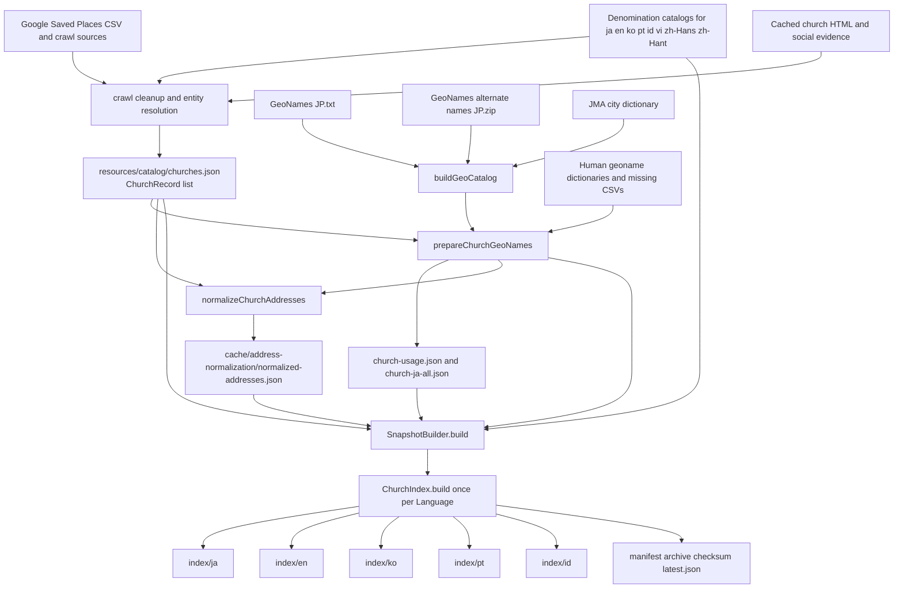

# Crossmap church index

This document is the maintained contract for the Crossmap lucene-kmp church index. Update it whenever a source, field, analyzer, schema version, snapshot layout, or query use changes.

The current schema is `ChurchIndex.SCHEMA_VERSION = 14`. One snapshot contains eight independent indexes with the same documents and field names:

```text
cache/search-indexes/churches/<version>/
├── index/
│   ├── ja/  JapaneseAnalyzer
│   ├── en/  EnglishAnalyzer
│   ├── ko/  KoreanAnalyzer (analysis-nori)
│   ├── pt/  PortugueseAnalyzer
│   ├── id/  IndonesianAnalyzer
│   ├── vi/  VietnameseAnalyzer (analysis-extra)
│   ├── zh-Hans/  SmartChineseAnalyzer
│   └── zh-Hant/  SmartChineseAnalyzer
├── geonames.json
└── manifest.json
```

Each language index has one Lucene `Document` per canonical `ChurchRecord`. The language changes the localized names, translated geonames, denomination names, analyzer, and whether Japanese-only website/address fields are present. It does not create different church identities.

## End-to-end build flow



The normal Gradle entry is:

```sh
./gradlew :crawl:buildSearchSnapshot -PcrossmapIndexVersion=development
```

Its dependencies prepare church geonames and normalize addresses before `SnapshotBuilder` builds the index. The direct crawler command is useful when those prerequisite artifacts are already current:

```sh
./gradlew :crawl:run --args='build-snapshot --version development'
```

## Responsible classes

| Module       | Kotlin class/file                                  | Responsibility                                                                                                                                                                                                                              |
|--------------|----------------------------------------------------|---------------------------------------------------------------------------------------------------------------------------------------------------------------------------------------------------------------------------------------------|
| `core`       | `Models.kt` / `ChurchRecord`                       | Canonical data that ultimately becomes one Lucene document. It owns names, localized names, denomination, address, coordinates, pages, social profiles, title languages, and the JSON detail payload.                                       |
| `core`       | `Language.kt` / `Language`                         | Defines the supported `ja`, `en`, `ko`, `pt`, and `id` indexes.                                                                                                                                                                             |
| `crawl`      | `SnapshotBuilder`                                  | Loads all build inputs, injects the five localized denomination names, rejects stale address-cache entries, selects translated geonames per language, calls `ChurchIndex.build` five times, and writes the manifest/archive/latest pointer. |
| `crawl`      | `ChurchGeoNameTranslationCatalog` and its pipeline | Produces per-church title/address geoname usage and translations from GeoNames, JMA, dictionaries, and reviewed missing CSVs.                                                                                                               |
| `crawl`      | `JapaneseAddressNormalizationPipeline`             | Runs the local Geolonia normalizer, checkpoints results, and produces typed normalized address components and administrative codes.                                                                                                         |
| `core`       | `JapaneseAddressNormalizer`                        | Defines `JapaneseAddress` and supplies the Kotlin fallback when no current external-normalizer cache entry is available.                                                                                                                    |
| `core`       | `ChurchIndex`                                      | Owns schema version, field constants, per-language analyzers, document formation, field types/storage, and `IndexWriter` creation. This is the authoritative field specification.                                                           |
| `core`       | `ChurchSearchEngine`                               | Owns the hot query path, query tiers, boosts, filters, result decoding, reader/searcher lifetime, and per-stage timing.                                                                                                                     |
| `core`       | `GeoNameResolver`                                  | Detects query geonames, resolves ambiguous names with device coordinates, and supplies one stable administrative code or a device-radius location to the search engine.                                                                     |
| `server`     | `resolveServerIndex` and Ktor `Application`        | Reject stale/schema-incompatible snapshots, select the query-language index, retain warmed searchers, and expose results as JSON.                                                                                                           |
| `app/shared` | Snapshot manager and local search repository       | Downloads/verifies the same snapshot and opens the appropriate language index locally on Android/iOS.                                                                                                                                       |

## Build inputs

### Canonical church record

`resources/catalog/churches.json` is the primary input. `SnapshotBuilder` hashes its exact bytes into `manifest.sourceSha256`; server startup refuses an index whose source hash differs from the current catalog.

Important `ChurchRecord` properties are:

| Property                     | Origin                                                          | Index use                                                                                                                      |
|------------------------------|-----------------------------------------------------------------|--------------------------------------------------------------------------------------------------------------------------------|
| `id`                         | Stable canonical/Google entity resolution                       | Exact lookup and result identity.                                                                                              |
| `name`                       | Canonical Japanese church name cleanup                          | Japanese name fields and stored response data.                                                                                 |
| `englishName`                | Deterministic/component/LLM translation pipeline                | English name fields and English-name static URL generation.                                                                    |
| `localizedNames`             | Google-title language detection plus five-language localization | Selected into the corresponding language index.                                                                                |
| `localizedDenominationNames` | Replaced at snapshot time from `denomination-<code>-names.json` | Denomination search and localized result/detail display.                                                                       |
| `titleLanguages`             | Languages originally present in the Google place title          | Exact filter for users searching churches whose original listing supports a language.                                          |
| `category`                   | Crawl/cleanup classification                                    | Japanese compact search and stored diagnostic/display field.                                                                   |
| `websiteUrl`                 | Parsed church website after `ChurchWebsitePolicy`                | Stored public detail link. Listing/search/map aggregators are excluded; missing or excluded values use `https://www.google.com/maps?cid=<googleCid>`. |
| `address`                    | Google/canonical Japanese address                               | Japanese analyzed address text and input to address normalization.                                                             |
| `location`                   | Google place latitude/longitude                                 | Device-radius filtering and distance display.                                                                                  |
| `pages`                      | Eligible church-owned cached pages classified by `CrawledContentType` | Japanese website-content fallback and matched snippets. Excluded listing domains and Google Maps fallback URLs are removed before crawling and again by `SnapshotBuilder`; sermon pages remain tagged for a future sermon index. |
| `socialProfiles`             | Website/evidence/programmatic/LLM social linking                | Japanese social text fallback and stored detail JSON.                                                                          |

### Denomination names

`SnapshotBuilder` loads `resources/catalog/denomination-{ja,en,ko,pt,id}-names.json`. For a record with a displayable `denominationId`, it replaces `localizedDenominationNames` with the complete five-language catalog values before indexing. `NOT_DETERMINED` and `INDEPENDENT_CHURCH` are internal sentinels, so they contribute no denomination text to the index or client detail. This prevents an old church record from silently carrying either an incomplete translation set or an internal identifier as user-facing text.

### Geoname translations and usage

- `resources/geonames/church-ja-all.json` maps each Japanese place to known `ja/en/ko/pt/id` forms.
- `resources/geonames/church-usage.json` records which places occurred in each church title and address.
- `SnapshotBuilder.translatedGeoNamesForLanguage` selects only translations available in the target index language and de-duplicates normalized values.
- `resources/geonames/japan.json` supplies administrative entities, aliases, centers, and stable codes to the resolver and address parser. `:crawl:buildGeoCatalog` rebuilds it from GeoNames plus JMA data before church-geoname preparation. JMA seven-digit keys are converted to official six-digit JIS local-government codes, designated-city wards are split into canonical ward names with parent-qualified aliases, and a missing designated parent city can be synthesized from its ward codes and address evidence. The catalog is also copied into every snapshot as `geonames.json`.
- The Japanese index derives hiragana readings with Kuromoji for church names, denomination/tradition text, categories, detected title/address geonames, and normalized-address components. `JapaneseReadingNormalizer` also indexes the common `にほん` alternative when Kuromoji emits `にっぽん`.

The translated names make a query such as `Tokyo`, `도쿄`, `Tóquio`, or `Tokyo` in Indonesian match the language-specific index without translating the query at runtime.

### Normalized addresses

`cache/address-normalization/normalized-addresses.json` is accepted only when its cached `originalAddress` still equals the current church address and normalization succeeded. The cache also stores the SHA-256 of `resources/geonames/japan.json`. A catalog-only change re-enriches cached Geolonia components with current entity codes without rerunning Node; a changed address runs the configured Geolonia checkout again. Otherwise `ChurchIndex.build` calls `JapaneseAddressNormalizer.normalize` as a fallback.

The important output is not only display text. Prefecture, municipality, and designated-city ward codes become exact Lucene terms used for fast, unambiguous geographic filtering.

## Analyzer contract

`ChurchIndex.analyzer(languageCode)` returns a `PerFieldAnalyzerWrapper`.

| Index   | Default analyzer     | Intended behavior                                                                 |
|---------|----------------------|-----------------------------------------------------------------------------------|
| `ja`    | `JapaneseAnalyzer`   | Kuromoji tokenization for Japanese names, address, categories, and crawled pages. |
| `en`    | `EnglishAnalyzer`    | English case/stem/stop-word behavior for names, geonames, and denominations.      |
| `ko`    | `KoreanAnalyzer`     | Nori morphological analysis for Korean names and translated metadata.             |
| `pt`    | `PortugueseAnalyzer` | Portuguese analysis for names and translated metadata.                            |
| `id`    | `IndonesianAnalyzer` | Indonesian analysis for names and translated metadata.                            |
| `vi`    | `VietnameseAnalyzer` | Vietnamese tokenization, stop-word filtering, normalization, and stemming from `lucene-kmp-analysis-extra`. |
| `zh-Hans`, `zh-Hant` | `SmartChineseAnalyzer` | Chinese segmentation plus canonical Simplified cross-script fields. |
| unknown | `StandardAnalyzer`   | Defensive fallback; not a supported published index.                              |

The wrapper explicitly routes `name_ja`, `name_en`, `name_ko`, `name_pt`, `name_id`, `name_vi`, `name_zh_hans`, and `name_zh_hant` through their matching analyzer. `StringField` values are never tokenized regardless of the wrapper.

## Field specification

`Stored = yes` means the original value can be read from Lucene. `Indexed = exact` means an untokenized `StringField`; `analyzed` means a tokenized `TextField`; `point/doc values` is the Lucene geographic representation. Most API output comes from the stored `record` JSON rather than reconstructing a church from individual fields.

### Identity, names, and language

| Lucene field                                                        | Type / stored                | Source and formation                                                                                | Purpose / current query use                                                                                                                    |
|---------------------------------------------------------------------|------------------------------|-----------------------------------------------------------------------------------------------------|------------------------------------------------------------------------------------------------------------------------------------------------|
| `id`                                                                | exact / yes                  | `ChurchRecord.id`                                                                                   | Exact church-detail lookup and stored identity.                                                                                                |
| `name_exact`                                                        | exact / no, multi-valued     | Every name selected for the current language, normalized by trim + lowercase + collapsed whitespace; normalized spaces are removed for Japanese-script values | Tier 1 exact-name query; boosted `1,000,000`. Japanese spacing is optional, while non-Japanese word boundaries remain significant.             |
| `name`                                                              | analyzed / yes, multi-valued | Current-language name list                                                                          | Tier 2 all-name-token query; boosted `1,000`. Also gives a human-readable stored name, although response decoding uses `record`.               |
| `name_ja`, `name_en`, `name_ko`, `name_pt`, `name_id`, `name_vi`, `name_zh_hans`, `name_zh_hant`, `name_other` | analyzed / no | Same values as `name`, routed to an explicit field analyzer | Language-explicit compatibility/experimentation fields. The schema-14 hot path uses `name` because each directory is already language-specific. |
| `name_reading`                                                       | analyzed / no, multi-valued  | Kuromoji hiragana readings of Japanese canonical/localized names                                    | Japanese name-token matching for kana input such as `かぬき 教会` and `せまる 教会`; queried with the other tier-2 name fields.                 |
| `name_reading_exact`                                                 | exact / no, multi-valued     | Compact Kuromoji hiragana readings with spaces removed                                               | Tier 1 kana whole-name matching without sending the reading back through `JapaneseAnalyzer`.                                                     |
| `localized_name`                                                    | exact / no, multi-valued     | Lowercased whitespace chunks of current-language names                                              | Compatibility/filter experimentation field; not on the schema-10 hot query path.                                                               |
| `title_language`                                                    | exact / no, multi-valued     | Normalized base codes from `ChurchRecord.titleLanguages`                                            | Optional API/CLI filter for languages present in the original Google place title. This is not the same as query-language detection.            |

Name selection is intentionally language-specific:

- `ja`: canonical `name` plus Japanese localized names.
- `en`: mandatory `englishName` plus English localized names.
- `ko`, `pt`, `id`: localized names for that code.

Blank and duplicate values are removed before fields are added.

### Fast combined search fields

| Lucene field     | Type / stored                | Source and formation                                                                                                                                                                      | Purpose / current query use                                                                                                                        |
|------------------|------------------------------|-------------------------------------------------------------------------------------------------------------------------------------------------------------------------------------------|----------------------------------------------------------------------------------------------------------------------------------------------------|
| `search_compact` | analyzed / no                | Current-language names + translated geonames + localized denomination names. Japanese additionally includes category, full address, and every derived reading. Values are de-duplicated and joined with newlines. | Tier 3 text scoring. One compact field avoids repeating every token across many boosted fields and is the principal schema-11 latency optimization. |
| `geoname`        | analyzed / no, multi-valued  | De-duplicated translated title/address geonames for this church and index language                                                                                                        | Auditable/experimental geoname field. Its values are included in `search_compact`; the current hot path queries the compact field.                 |
| `denomination`   | analyzed / yes, multi-valued | Displayable denomination catalog value for this index language; internal unknown/independent sentinels are omitted                                                                        | Stored diagnostic/display value and experimental direct field. It is also included in `search_compact`.                                            |
| `geoname_reading` | analyzed / no, multi-valued | Hiragana readings of Japanese detected geonames and normalized-address components                                                                                                        | Auditable Japanese kana-geoname field; readings also enter `search_compact`.                                                                       |
| `denomination_reading`, `category_reading` | analyzed / no, multi-valued | Hiragana readings of Japanese denomination/tradition and category text                                                                                                      | Allow kana queries such as `にほんきりすときょうだん` and `ばぷてすと`; readings also enter `search_compact`.                                      |
| `denomination_reading_exact`, `category_reading_exact` | exact / no, multi-valued | Compact hiragana readings with spaces removed | Tier 1 exact-reading boosts put churches of a kana-entered denomination/tradition ahead of incidental website/content matches. |
| `category`       | analyzed / yes               | Japanese `ChurchRecord.category` only                                                                                                                                                     | Japanese classification search and diagnostics; included in `search_compact`.                                                                      |
| `address`        | analyzed / yes               | Full canonical Japanese address, Japanese index only                                                                                                                                      | Japanese address text search; included in `search_compact`. Exact area filtering uses codes instead.                                               |

### Exact normalized address fields

| Lucene field                | Type / stored            | Source                                                                  | Purpose                                                                                                       |
|-----------------------------|--------------------------|-------------------------------------------------------------------------|---------------------------------------------------------------------------------------------------------------|
| `address_geoname_code`      | exact / no, multi-valued | Every available prefecture, municipality, and designated-city ward code | Named-place filter. `GeoNameResolver` chooses exactly one entity, then `TermQuery` filters this field; geoname-only and explicit-administration queries apply it to every tier. |
| `address_prefecture`        | exact / yes              | `JapaneseAddress.prefecture`                                            | Inspection and future structured display/filtering.                                                           |
| `address_prefecture_code`   | exact / yes              | `JapaneseAddress.prefectureCode`                                        | Inspection; same code is also added to `address_geoname_code`.                                                |
| `address_county`            | exact / yes              | `JapaneseAddress.county`                                                | Inspection and future structured filtering.                                                                   |
| `address_municipality`      | exact / yes              | City/town/village component                                             | Inspection and future structured display/filtering.                                                           |
| `address_municipality_code` | exact / yes              | Municipality code                                                       | Inspection; same code is also added to `address_geoname_code`.                                                |
| `address_city_ward`         | exact / yes              | Designated-city ward component such as `福岡市中央区`                         | Distinguishes same-named wards in different cities.                                                           |
| `address_city_ward_code`    | exact / yes              | Designated-city ward code                                               | Inspection; same code is also added to `address_geoname_code`.                                                |
| `address_kyoto_street`      | exact / yes              | Kyoto street-expression component                                       | Preserves Kyoto-specific normalization detail.                                                                |
| `address_locality`          | exact / yes              | Locality below municipality/ward                                        | Future structured display/filtering.                                                                          |
| `address_number`            | exact / yes              | Block/lot/building number                                               | Future structured display.                                                                                    |
| `address_building`          | exact / yes              | Building/floor suffix                                                   | Future structured display.                                                                                    |

All of these fields are present in all five indexes because geography and structured detail are language-independent.

### Website, social, content type, and record payload

| Lucene field   | Type / stored            | Source and formation                                                                  | Purpose / current query use                                                                                                                                                                  |
|----------------|--------------------------|---------------------------------------------------------------------------------------|----------------------------------------------------------------------------------------------------------------------------------------------------------------------------------------------|
| `content`      | analyzed / no            | Every eligible church-owned page's title and visible text joined with newlines; Japanese index only | Tier 4 fallback when fast tiers do not fill the requested page. Listing/search/map aggregator pages are excluded before acquisition and snapshot construction. |
| `social`       | analyzed / no            | Social profile handle + display name + description; Japanese index only               | Same conditional tier-4 fallback, and room for later social-data search improvements.                                                                                                        |
| `content_type` | exact / no, multi-valued | Distinct `CrawledContentType.name` values from pages; Japanese index only             | Separates ordinary/about/contact/sermon evidence for future filters and a dedicated sermon index.                                                                                            |
| `record`       | stored only              | Complete Kotlin-serialized `ChurchRecord` after denomination enrichment and final `ChurchWebsitePolicy` sanitization | Authoritative API result/detail decode. The server reapplies the policy when decoding results so a stale index cannot expose an excluded listing domain. Adding a required model property requires rebuilding the index. |

### Coordinates

| Lucene field | Type / stored                               | Source                  | Purpose                                                                                                                                                                    |
|--------------|---------------------------------------------|-------------------------|----------------------------------------------------------------------------------------------------------------------------------------------------------------------------|
| `location`   | `LatLonPoint` + `LatLonDocValuesField` / no | `ChurchRecord.location` | Device-location radius filtering plus nearest-first `LatLonDocValuesField` sorting. Named Japanese places never use this field as an inside/outside boundary; they use exact administrative codes. |

## Query-to-field behavior

`ChurchSearchEngine` opens one immutable `FSDirectory`, reader, and `IndexSearcher` per language and keeps them for the server/app lifetime. It builds these tiers:

1. **Exact name**: normalized full query → `name_exact`, normally without a geographic filter, boost `1,000,000`.
2. **All name tokens**: full query analyzed in the detected query language → every token MUST occur in `name`, normally without a geographic filter, boost `1,000`. Generic church-only or geoname-only queries disable this tier.
3. **Address entity + remainder**: query geoname resolution selects one `address_geoname_code`; remaining non-generic terms MUST occur in `search_compact`. Generic words such as `教会`/`church` are dropped from this tier because they add posting-list cost but almost no discrimination. A geoname-only or geoname-plus-generic-church query uses `MatchAllDocsQuery` plus the code filter. If the location comes from browser/app coordinates because no name was given, the filter is a `LatLonPoint` radius and the full distinctive text remains searchable.
4. **Content fallback**: Japanese `content` and `social` fields. It runs only when the fast tiers return fewer documents than `offset + limit`.

Tiers 1–3 are one boosted Lucene `SHOULD` query with `minimumShouldMatch=1`, so Lucene collects and counts once. Exact matches therefore remain first while all-token and geographic matches fill the remainder. Results are de-duplicated naturally because every tier targets the same Lucene document.

An explicit administrative name or geoname-only query adds the same exact code filter to tiers 1 and 2. This includes Japanese suffixes and romanized forms such as `Yokohama-cho`, `Yokohamacho`, `Aomori-ken`, and `Yokohama-shi`. It prevents an analyzed `横浜町` query from falling through to churches in `横浜市`. A bare geoname embedded in a longer church name keeps the global exact-name tier, while its address-code filter is applied in the geoname/remainder tier.

Administrative representative points come from `resources/geonames/japanese-local-goverment-offices.json` and are copied into `japan.json`. They choose the nearest entity for ambiguous names and label device results such as `伊豆市付近`; their coordinates and any `GeoName.coveringRadiusKm` metadata do not define named-search boundaries.

Query-language detection happens before `ChurchSearchEngine` selection. UI/display language does not select the analyzer. A Japanese browser searching `Tokyo Baptist Church` still opens the English index and uses `EnglishAnalyzer`.

For full query-planning details and geographic disambiguation, see [SEARCH.md](SEARCH.md).

## Snapshot integrity and publication

`SnapshotBuilder` writes an `IndexManifest` containing:

- schema and index versions;
- lucene-kmp version;
- creation timestamp and document count;
- all eight language codes;
- exact canonical-catalog SHA-256;
- archive name, size, and SHA-256.

The server accepts `latest.json` only when the schema matches `ChurchIndex.SCHEMA_VERSION`, the selected language directory exists, and the canonical catalog hash matches. Mobile activation downloads to a temporary file, verifies the checksum/manifest, stages extraction, and atomically switches the active version.

## How to inspect and change the index safely

When changing any index field or formation rule:

1. Edit `ChurchIndex` and increment `SCHEMA_VERSION` when existing snapshots are incompatible.
2. Update the field table and query behavior in this document in the same change.
3. Update `ChurchSearchEngine` and [SEARCH.md](SEARCH.md) if query use changed.
4. Add a focused `ChurchIndexTest` or `ChurchSearchEngineTest` using a real church name/address.
5. Run `./gradlew :core:jvmTest :crawl:test :cli:test :server:test`.
6. Rebuild the development snapshot and confirm its manifest schema/source hash.
7. Benchmark warm searches with `./gradlew :server:runCurrentIndex`; do not use `:server:run` for a search-only benchmark because it orchestrates crawl cleanup and static generation.
8. Run the Lightpanda E2E before publication.

Useful query logs are `search-query-plan`, `search-query-lucene`, `search-timing`, and Ktor `search-http-timing`. They show analyzed tokens, selected administrative entity, every tier/filter, and the monotonic duration of request parsing, Lucene collection, decoding, and JSON response construction.
