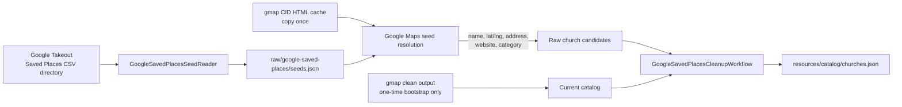
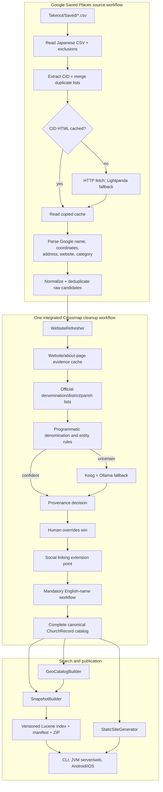
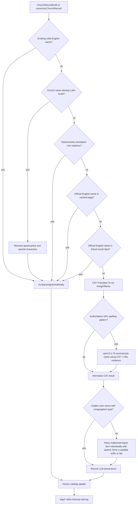

# Crossmap crawl module

The `crawl` module turns raw church-source data and downloaded web evidence into the canonical standalone Crossmap catalog at `resources/catalog/churches.json`. It also builds geonames, resolves denominations and social accounts, assigns mandatory English church names, and publishes versioned search-index snapshots.

## Where does the data begin?

There are two inputs to understand:

1. **Current bootstrap data:** `resources/catalog/churches.json` was created once from the clean data under the old gmap `output` directory. The cached HTML was also copied into `resources/crawl/pages`. Crossmap does not need the gmap project at runtime.
2. **Permanent repeatable starting point:** the personal Google Takeout Saved Places CSV directory (containing files such as `教会.csv` and `カトリック教会.csv`) is passed to `read-google-saved-places`. Crossmap reads the real Japanese `タイトル,メモ,URL,コメント` schema, extracts stable Google CIDs, merges duplicates across lists, and writes `resources/raw/google-saved-places/seeds.json` plus an error/report file.

The CSV reader, CID-page resolver, and promotion workflow are standalone Crossmap stages. Resolution prefers the copied gmap CID HTML cache, uses plain HTTP and then Lightpanda only for missing pages, extracts the same Google place fields as gmap, and writes raw candidates plus an audit report. Promotion normalizes/deduplicates candidates, reuses prior evidence, resolves every mandatory English name, runs the existing website/directory/denomination cleanup, and atomically replaces the canonical catalog only after all gates pass. Crossmap never imports or calls gmap code.

## End-to-end data flow

All accepted derived fields carry provenance through `FieldDetermination`: programmatic, LLM, or human. Human overrides always win. Social data and sermon evidence have typed places in the evidence model even though their full crawlers are later work.

## English-name workflow

Every final `ChurchRecord` must have an English/Latin-script name. Static publication is a hard gate: it fails if even one record is unresolved.

Current deterministic rules implement `ChurchNameEnglishTranslationRule`:

- `GeonameTraditionChurchNameRule`: `東京バプテスト教会` -> `Tokyo Baptist Church`; the denomination prefix is added later to the URL (`hpbc-tokyo-baptist-church.html`).
- `DenominationAliasGeonameChurchNameRule`: checks every denomination name and alias from `resources/catalog/denominations.json`; `日本基督教団赤羽教会` -> `Akabane Church`, then the URL gets `uccj-`.
- `GeonameChristianAssemblyNameRule`: `経堂キリスト集会` -> `Kyodo Christian Assembly`. Independent assemblies omit denomination and retain “Assembly,” respecting their own terminology.
- `RomanizedJapaneseChurchNameRule`: for records without an official/custom URL hint, uses lucene-kmp Kuromoji readings to deterministically romanize Japanese proper names and preserves `Church`, `Chapel`, `Cathedral`, `Mission`, or `Assembly` terminology. Custom church URLs stay on the LLM path because their Latin tokens may be authoritative.

URL text is never accepted as a complete name by a deterministic rule. Explicit URL patterns only supply authoritative spelling evidence to the reconstruction LLM: `/church/lucia/` can correct kana romanization to `Lucia`, and `kokoronotomo-ch.org` can preserve `Kokoronotomo` instead of semantically translating `心の友`.

## Command entry points

All commands run through `./gradlew :crawl:run --args='COMMAND ...'`.

| Command | Purpose | Main inputs | Main outputs |
|---|---|---|---|
| `read-google-saved-places` | Read and deduplicate the personal Google Takeout Saved Places dump without gmap. | `--input Takeout/Saved`, all Saved-list CSV files | `raw/google-saved-places/seeds.json`, `seed-read-report.json` |
| `resolve-google-saved-places` | Resolve seeds through copied CID cache, HTTP, then Lightpanda; reproduce gmap place extraction and Catholic filtering. | seeds, `raw/google-maps-pages` | `google-place-candidates.json`, `google-place-resolution-report.json` |
| `promote-google-saved-places` | Normalize/deduplicate candidates and feed them through the shared website, official-directory, denomination, English-name, and override workflow. | candidates, existing evidence/catalog, cleanup configuration | complete canonical catalog plus cleanup reports |
| `refresh` | Download or reuse church webpages concurrently. | catalog, prior crawl manifest/cache | `crawl/pages`, `crawl/manifest.json`, URL cache map, updated page evidence |
| `crawl-denomination-directories` | Crawl configured denomination, diocese, district, parish, and branch lists. | `sources/denominations.json`, cached/HTTP pages | `cleanup/denomination-candidates.json` |
| `cleanup-llm` | Resolve denomination fields with programmatic rules, optional Ollama fallback, and human overrides. | catalog, denomination catalog, candidates, rules, overrides | updated catalog, `cleanup/decisions.json` |
| `override-denomination` | Record a reviewed denomination correction. | command arguments, prior overrides | `cleanup/human-overrides.json` |
| `link-social` | Link social candidates to churches with direct links, exact/contains matching, then LLM fallback. | catalog, social candidates, cached pages | updated social profiles, `cleanup/social-decisions.json` |
| `english-names` | Populate every English name and atomically rewrite the catalog. | church/denomination catalogs, cached pages, Ollama | complete catalog, timestamped cleanup statistics |
| `denomination-english-names` | Build the denomination-ID-to-English-name map used in static URLs. | denomination catalog, Ollama for unresolved names | `catalog/denomination-english-names.json` |
| `build-geonames` | Build prefecture/city/ward search geonames. | catalog plus the supplied municipality source | `geonames/japan.json` |
| `build-snapshot` | Build and package the versioned Lucene church-search index. | complete catalog and geonames | `indexes/churches/VERSION` and latest metadata |

Gradle orchestration:

- `./gradlew :crawl:dataCleanup` is the production English-name cleanup task. It runs `df -h /media/joel/llms` immediately before Ollama work.
- `./gradlew :server:generateChurchPages` depends on `:crawl:dataCleanup` and denomination-English-name generation before rendering static pages.
- Each cleanup invocation leaves a unique `logs/YYYY-MM-DD-HH-mm-data-cleanup-stat.log` with deterministic and LLM counts, unresolved count, errors, LLM timeouts, duration, and throughput.

## Classes by source file

### `Main.kt`

- `Crawl` is the Clikt root command.
- `ReadGoogleSavedPlaces`, `Refresh`, `CrawlDenominationDirectories`, `CleanupLlm`, `OverrideDenomination`, `LinkSocial`, `PopulateEnglishNames`, `PopulateDenominationEnglishNames`, `BuildGeonames`, and `BuildSnapshot` adapt command-line options to the pipeline classes described below.
- `DenominationNameInput` is the small serialization shape needed when translating denomination names.
- `writeDataCleanupStat` writes the mandatory per-run cleanup report, including failed runs.

### `GoogleSavedPlacesSeedReader.kt`

- `GoogleSavedPlacesSeedReader` implements the standalone first stage of the former gmap workflow: RFC 4180 CSV parsing, Japanese/English header aliases, CID extraction from Takeout or canonical Maps URLs, cross-list deduplication, and durable raw JSON.
- `GoogleSavedPlaceSeed` intentionally contains only fields present in the dump. It is not a partially valid `ChurchRecord`; Google-page resolution must supply the remaining place evidence first.
- `GoogleSavedPlacesSeedReport` and `GoogleSavedPlacesSeedError` preserve row counts, duplicates, and malformed-row diagnostics without stopping valid rows.

### `GoogleMapsPlaceResolver.kt`

- `CachedGoogleMapsPageSource` reproduces gmap's cache-first acquisition, including its verified CID redirect edge case; missing pages try normal HTTP and then a Lightpanda-rendered page.
- `GoogleMapsPlaceParser` extracts Google place name, coordinates, address, website, and category into `GooglePlaceChurchCandidate` without pretending the raw result is already canonical.
- `GoogleMapsPlaceResolver` resolves with bounded concurrency, applies gmap's Catholic-list non-church filter, and atomically writes candidates and `GoogleMapsResolutionReport` diagnostics.

### `GoogleSavedPlacesCleanupWorkflow.kt`

- `GoogleSavedPlacesCleanupWorkflow` is the single promotion bridge from raw Google candidates into the normal Crossmap cleanup workflow; it does not duplicate denomination/LLM logic.
- It exact-deduplicates normalized name/address candidates, retains non-Google records, reuses evidence by CID, stages work under `resources/cleanup`, and promotes atomically only after mandatory fields are complete.
- `GoogleSavedPlacesPromotionReport` and `PreparationReport` expose candidate, evidence, website, denomination, English-name, and promotion completeness counts.

### `LightPanda.kt`

- `LightPanda` is the lightweight JavaScript-rendering fallback. It invokes `lightpanda fetch --dump html URL`, validates HTTP(S) input, drains bounded stdout/stderr concurrently, enforces a timeout, terminates hung processes, and returns rendered HTML.
- Set `LIGHTPANDA_BINARY` when the executable is not on `PATH`. `TestLightPanda.kt` covers the command contract and errors; set `CROSSMAP_LIGHTPANDA_INTEGRATION=1` to exercise the installed binary.

### `CrawlManifest.kt` and `Hashing.kt`

- `CrawlManifestEntry` records source URL, HTTP status, hash/cache path, acquisition mode, timestamps, and errors for reproducible cached crawling.
- `sha256` supplies stable content-addressed cache and snapshot hashes.

### `WebsiteRefresher.kt`

- `WebsiteRefresher` reads church website URLs, reuses copied/previous cache entries, fetches changed content with bounded concurrency, extracts page text, and atomically updates the manifest/catalog.
- `RefreshReport`, `ChurchRefresh`, and `FetchResult` carry aggregate and per-fetch outcomes.

### `OfficialDirectoryCrawler.kt`

- `DenominationDirectorySource` and `DenominationJurisdictionSource` describe generic CSS-selector-driven official lists, including nested diocese/district/parish/branch pages.
- `DirectoryPageLoader` abstracts page loading; `HttpDirectoryPageLoader` fetches pages and `CachedDirectoryPageLoader` prefers the Crossmap cache.
- `OfficialDirectoryCrawler` walks configured sources and emits normalized denomination candidates rather than hard-coding each denomination in Kotlin.
- `JurisdictionKind`, `LoadedDirectoryPage`, `DirectoryEntry`, `DirectoryTarget`, and `DirectoryCrawlReport` represent directory hierarchy, work items, and results.

### `DataCleanup.kt`

- `PostCrawlCleanup` orchestrates denomination cleanup and atomic catalog/audit writes.
- `ProgrammaticDenominationMatcher` applies ordered deterministic candidates/rules.
- `EntityMatcher` is the cleanup fallback contract; `KoogOllamaEntityMatcher` implements it with local Ollama and exposes its model through `ModelIdentified`.
- `DenominationCandidate`, `DenominationRule`, `HumanOverride`, `EntityMatchInput`, `EntityMatchDecision`, `ProgrammaticDecision`, `CleanupAuditEntry`, and `CleanupReport` are durable inputs/outputs and audit records.

### `DenominationDeterminer.kt`

- `Denomination` is the expandable canonical definition: ID, Japanese name, every known alias, official site, and proposed status.
- `ProgrammaticDenominationDeterminer` checks exact names/aliases in church names and selected crawled pages.
- `DenominationGuesser` is the fallback contract; `KoogDenominationGuesser` asks Ollama for a scored guess over bounded webpage text.
- `DenominationGuessResult` and private `WireResult` separate domain output from model wire JSON.

### `LlmEntitySimilarity.kt`

- `JapaneseEntityNormalizer` normalizes Japanese names and addresses for cheap overlap/exact checks.
- `LlmEntitySimilarityMatcher` scores ambiguous name/address/entity pairs; `KoogLlmEntitySimilarityMatcher` is the local model implementation.
- `SimilarityField`, `EntitySimilarityInput`, and `SimilarityDecision` make the comparison type and evidence explicit.

### `SocialAccountLinker.kt` and `SocialLinkPipeline.kt`

- `SocialAccountLinker` enforces precedence: direct webpage URL, exact/either-name-contains, then LLM score; ambiguous/low results stay unmatched.
- `SocialLinkPipeline` loads candidates/cache evidence, runs the linker, records provenance, and atomically updates the catalog/audit file.
- `SocialAccountCandidate`, `SocialLinkDecision`, and `SocialLinkReport` are the candidate, per-decision, and aggregate forms.

### `ChurchNameEnglishTranslationRule.kt`

- `ChurchNameEnglishTranslationRule` is the extension point for cheap deterministic Japanese-name patterns.
- `GeonameTraditionChurchNameRule`, `DenominationAliasGeonameChurchNameRule`, `GeonameChristianAssemblyNameRule`, and `RomanizedJapaneseChurchNameRule` implement the current ordered rules.
- `ChurchNameEnglishTranslationRules` owns rule ordering and shared geoname/tradition dictionaries. New patterns should be separate classes with real-data tests.

### `JapaneseNameRomanizer.kt`

- `JapaneseNameRomanizer` uses lucene-kmp Kuromoji's reading-form filter in romaji mode, so nationwide Japanese place/proper names can be translated deterministically without a hand-maintained 1,700-city switch statement.

### `ChurchEnglishNameResolver.kt`

- `ChurchEnglishNameResolver` applies the precedence diagram above and returns provenance-aware `ResolvedChurchEnglishName` values.
- `ChurchEnglishNameInput` is the pre-publication naming shape, so unfinished crawl data never needs a fake or blank `ChurchRecord.englishName`.
- `ChurchRecordDraft.toChurchRecord` is the only publication transition: it requires a resolution, refuses partial coverage, and attaches `FieldDetermination` before the atomic command update.
- `ChurchEnglishNameTranslator` is the expensive fallback contract; `KoogChurchEnglishNameTranslator` combines CAT translation with selective URL reconstruction.
- `ChurchNamePartRole`, `TranslatedChurchNamePart`, `ChurchEnglishNameGuess`, `ProgrammaticEnglishName`, and `ResolvedChurchEnglishName` record split parts, confidence, evidence, model, and result source.

### `ChurchRecordDraft.kt` and `CachingChurchEnglishNameTranslator.kt`

- `ChurchRecordDraft` decodes unfinished/legacy crawl data and can become a canonical `ChurchRecord` only with a validated `ResolvedChurchEnglishName`.
- `CachingChurchEnglishNameTranslator` atomically checkpoints every completed model batch in `resources/cleanup/english-name-llm-cache.json`; interrupted runs reuse matching church/model results and expose cache, batch, error, and timeout statistics.

### `KoogJapaneseTextTranslator.kt`, `KoogChurchNameReconstructor.kt`, and Ollama agents

- `KoogJapaneseTextTranslator` batches CAT-Translate-7b requests and falls back to an individual request if a numbered batch line is missing.
- `KoogChurchNameReconstructor` extracts only explicit URL spelling patterns and asks `qwen3:1.7b` to reconcile them with CAT output.
- `KoogOllamaTextAgent` is the direct single-prompt executor used by translation models; it avoids an agent loop.
- `KoogOllamaJsonAgent` is the bounded JSON agent used by classification/matching tasks.

### `EvidencePipeline.kt`

- `EvidenceStore` writes immutable evidence, candidates, and resolutions under the resource root.
- `EvidencePipelineRunner` runs named resumable stages and persists `PipelineState` after each stage.
- `PipelineStage`, `NamedPipelineStage`, and `PipelineContext` define stage execution.
- `EvidenceKind`, `EvidenceEntityType`, `EvidenceRecord`, `CandidateRelationship`, `EntityCandidateLink`, `ResolutionStatus`, and `EntityResolution` are generic enough for churches, denominations, social profiles, and future sermons.

### `GeoCatalogBuilder.kt`

- `GeoCatalogBuilder` combines all 47 prefectures with municipality/ward source data, church coordinates, aliases, centers, and covering radii into the search geoname catalog.

### `SnapshotBuilder.kt`

- `SnapshotBuilder` builds the church Lucene index, copies the exact geoname catalog used by the index, writes a manifest, ZIPs the immutable snapshot, computes SHA-256, and atomically updates latest metadata for CLI/server/mobile consumers.

## Adding a new stage or rule

1. Preserve raw evidence; do not overwrite the HTML cache.
2. Make the stage deterministic and resumable before adding LLM fallback.
3. Put thresholds/model/evidence in an auditable result object.
4. Record programmatic, LLM, or human provenance.
5. Add real Japanese church fixtures to unit tests.
6. Add the stage to this README and to the appropriate Clikt/Gradle orchestration.
