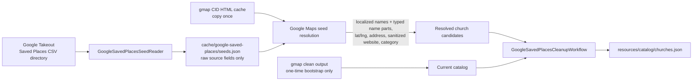
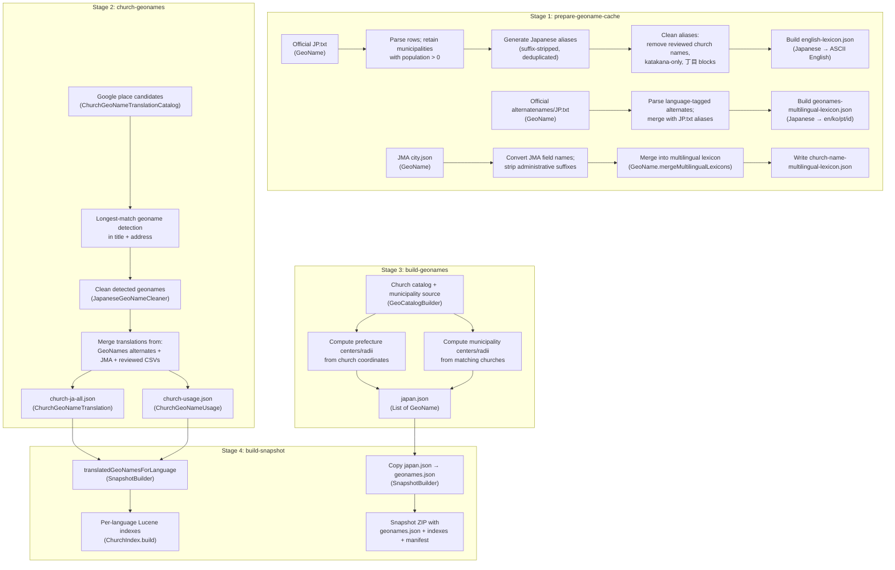
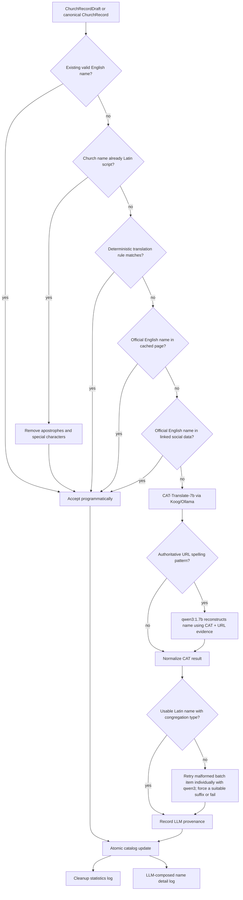

# Crossmap crawl module

The `crawl` module turns raw church-source data and downloaded web evidence into the canonical standalone Crossmap catalog at `resources/catalog/churches.json`. It also builds geonames, resolves denominations and social accounts, assigns mandatory English church names, and publishes versioned search-index snapshots.

## Where does the data begin?

There are two inputs to understand:

1. **Current bootstrap data:** `resources/catalog/churches.json` was created once from the clean data under the old gmap `output` directory. The copied HTML now lives in `cache/church-web-pages`. Crossmap does not need the gmap project at runtime.
2. **Permanent repeatable starting point:** the personal Google Takeout Saved Places CSV directory (containing files such as `教会.csv` and `カトリック教会.csv`) is passed to `read-google-saved-places`. Crossmap reads the real Japanese `タイトル,メモ,URL,コメント` schema, extracts stable Google CIDs, merges duplicates across lists, and writes seeds and audit output under `cache/google-saved-places`.

The CSV reader, CID-page resolver, and promotion workflow are standalone Crossmap stages. Resolution prefers the copied gmap CID HTML cache, uses plain HTTP and then Lightpanda only for missing pages, extracts the same Google place fields as gmap, and writes raw candidates plus an audit report. Promotion normalizes/deduplicates candidates, reuses prior evidence, resolves every mandatory English name, runs the existing website/directory/denomination cleanup, and atomically replaces the canonical catalog only after all gates pass. Crossmap never imports or calls gmap code.



## End-to-end data flow

```mermaid
flowchart TD
    subgraph SOURCE[Google Saved Places source workflow]
        A[Takeout/Saved/*.csv] --> B["Read Japanese CSV + exclusions<br/>(GoogleSavedPlacesSeedReader)"]
        B --> C["Extract CID + merge duplicate lists<br/>(GoogleSavedPlacesSeedReader)"]
        C --> D{CID HTML cached?}
        D -->|yes| E["Read copied cache<br/>(GoogleMapsPlaceResolver)"]
        D -->|no| F["HTTP fetch; Lightpanda fallback<br/>(GoogleMapsPlaceResolver)"]
        F --> E
        E --> G["Parse Google title and place fields<br/>(GoogleMapsPlaceResolver)"]
        G --> G2["Detect each name-part language;<br/>translate with reviewed dictionaries + GeoNames<br/>(MultilingualChurchNameLocalizer)"]
        G2 --> H["Normalize + deduplicate resolved candidates<br/>(GoogleSavedPlacesCleanupWorkflow)"]
    end
    subgraph CLEANUP[One integrated Crossmap cleanup workflow]
        H --> I["WebsiteRefresher<br/>(WebsiteRefresher)"]
        I --> J[Website/about-page evidence cache]
        J --> K["Official denomination/district/parish lists<br/>(dedicated + generic crawlers)"]
        K --> L["Programmatic denomination and entity rules<br/>(DataCleanup)"]
        L -->|uncertain| M["Koog + Ollama fallback<br/>(DenominationDeterminer)"]
        L -->|confident| N[Provenance decision]
        M --> N
        N --> O[Human overrides win]
        O --> P["Social linking extension point<br/>(SocialAccountLinker)"]
        P --> Q["Mandatory English-name workflow<br/>(ChurchEnglishNameResolver)"]
        Q --> R["Complete canonical ChurchRecord catalog<br/>(ChurchRecordDraft)"]
    end
    subgraph PUBLICATION[Search and publication]
        R --> S["GeoCatalogBuilder<br/>(GeoCatalogBuilder)"]
        R --> T["SnapshotBuilder<br/>(SnapshotBuilder)"]
        S --> T
        T --> U[Versioned Lucene index + manifest + ZIP]
        R --> V[StaticSiteGenerator]
        U --> W[CLI, JVM server/web, Android/iOS]
        V --> W
    end
```



All accepted derived fields carry provenance through [`FieldDetermination`](../core/src/commonMain/kotlin/jp/co/crossmap/Models.kt): programmatic, LLM, or human. Human overrides always win. Social data and sermon evidence have typed places in the evidence model even though their full crawlers are later work.

## Geoname data processing

Geonames provide geographic location detection for church searches. The pipeline
turns official Japanese municipality data into a runtime search catalog and
per-church translation catalog, enabling location-aware queries in all supported
languages.

### Data sources

| Source | Path | Purpose |
|---|---|---|
| Official GeoNames JP dump | `cache/geoname/japan/JP.txt` | Japanese municipality names, coordinates, population |
| Official GeoNames alternate names | `cache/geoname/japan/alternatenames/JP.txt` | Language-tagged alternate names (en/ko/pt/id) |
| JMA multilingual city dictionary | [`resources/geonames/jma-city.json`](resources/geonames/jma-city.json) | en/ko/pt/id translations maintained by Japan Meteorological Agency |
| Municipality source | (supplied at build time) | `code → "name"` mapping for all municipalities |
| Church catalog | [`resources/catalog/churches.json`](../resources/catalog/churches.json) | Church coordinates used to compute geoname centers and radii |
| Google place candidates | `cache/google-saved-places/google-place-candidates.json` | Source of truth for which geonames appear in church titles/addresses |
| Duplicated church name exclusion list | [`resources/geonames/geoname-duplicated-church-name.csv`](resources/geonames/geoname-duplicated-church-name.csv) | Geoname aliases that collide with church names |

### Processing pipeline



### Stage details

**Stage 1 — `prepare-geoname-cache`** ([`GeoName.kt`](src/main/kotlin/jp/co/crossmap/crawl/GeoName.kt), [`Main.kt`](src/main/kotlin/jp/co/crossmap/crawl/Main.kt#L306-L366))

Downloads and processes official GeoNames data. Produces two lexicons:

- `cache/geoname/japan/church-name-lexicon.json` — Japanese-to-English name map for church name generation.
- `cache/geoname/japan/church-name-multilingual-lexicon.json` — Japanese-to-{en,ko,pt,id} map from official alternate names + JMA city dictionary.

The multilingual lexicon is the translation source used by stages 2 and 4.
[`JapaneseGeoNameCleaner`](src/main/kotlin/jp/co/crossmap/crawl/GeoName.kt#L60-L99) removes aliases that collide with church names, are katakana-only, or are `丁目` address blocks.

**Stage 2 — `church-geonames`** ([`ChurchGeoNameTranslationCatalog.kt`](src/main/kotlin/jp/co/crossmap/crawl/ChurchGeoNameTranslationCatalog.kt), [`Main.kt`](src/main/kotlin/jp/co/crossmap/crawl/Main.kt#L368-L422))

Builds the per-church geoname translation catalog. For each church, detects geonames in the title and address using longest-match against the multilingual lexicon. Produces:

- [`resources/geonames/church-ja-all.json`](resources/geonames/church-ja-all.json) — `List<ChurchGeoNameTranslation>` mapping each Japanese geoname to its en/ko/pt/id translations.
- [`resources/geonames/church-usage.json`](resources/geonames/church-usage.json) — `List<ChurchGeoNameUsage>` recording which geonames appear in each church's title and address.

Separate title-first and address-only review CSVs are maintained for missing translations.

**Stage 3 — `build-geonames`** ([`GeoCatalogBuilder.kt`](src/main/kotlin/jp/co/crossmap/crawl/GeoCatalogBuilder.kt), [`Main.kt`](src/main/kotlin/jp/co/crossmap/crawl/Main.kt#L288-L304))

Builds the search geoname catalog ([`resources/geonames/japan.json`](resources/geonames/japan.json)). For each of the 47 prefectures and all municipalities from the source data:

- Computes the geographic center from matching church coordinates.
- Computes the covering radius (max distance from center + 10km buffer, minimum 15km).
- Generates Japanese suffix-stripped aliases (e.g., `東京都` → `東京`).

Output: `List<GeoName>` serialized to `resources/geonames/japan.json`. This file is copied into each snapshot as `geonames.json`.

**Stage 4 — `build-snapshot`** ([`SnapshotBuilder.kt`](src/main/kotlin/jp/co/crossmap/crawl/SnapshotBuilder.kt), [`Main.kt`](src/main/kotlin/jp/co/crossmap/crawl/Main.kt#L450-L482))

Copies `japan.json` into the snapshot and builds per-language Lucene indexes. For each language (ja/en/ko/pt/id), [`translatedGeoNamesForLanguage`](src/main/kotlin/jp/co/crossmap/crawl/SnapshotBuilder.kt#L102-L108) looks up each church's detected geonames in `church-ja-all.json` and returns the translated strings. These translated geonames are indexed into the Lucene `geoname` field, enabling text-based geographic matching within each language's index.

### Runtime query flow

At query time, the server loads `japan.json` into a [`GeoNameResolver`](../core/src/commonMain/kotlin/jp/co/crossmap/GeoNameResolver.kt), which matches user query text against canonical names, aliases, translations, and Japanese kana readings. A named administrative entity becomes one exact normalized-address code filter. `LatLonPoint` distance filtering is reserved for device-location fallback when the query has no named geoname.

> **Note:** `GeoNameResolver` matches Japanese `name`/`aliases` for all queries, and additionally matches the query language's translation when `language != "ja"`. This enables location detection for English, Korean, Portuguese, and Indonesian queries (e.g., "Tokyo Baptist Church" resolves to 東京都).

### Multilingual church-name cleanup

For a successfully decomposed Latin-source title, the deterministic recomposed Japanese name is authoritative. Earlier word-by-word Japanese aliases are discarded so decomposed accents or connectors cannot leak mixed forms such as `ペンテコステDEUSエ́AMOR教会` or `デ名古屋` into the catalog.

`ChurchNameDecomposer` preserves Japanese parenthesized kana evidence before generic parenthesis cleanup. For example, `香貫(かぬき)教会` produces canonical `香貫教会` plus searchable Japanese alias `かぬき教会`; reviewed readings that are not present in the current Google title live in `resources/catalog/church-name-readings.json`.

`MultilingualChurchNameLocalizer` decomposes non-Japanese names into typed denomination, tradition, geoname, concept, congregation, and residual parts. The committed `resources/dictionary/congregation-terms.json` contains whole-name equivalents for phrases whose meaning is destroyed by word-by-word transliteration. Thus `Igreja Pentecostal Deus É Amor` becomes `神は愛なりペンテコステ教会`, and Portuguese location aliases such as `Nagoia` are resolved through the multilingual geoname catalog before Japanese word ordering is applied. Romance connectors such as `de` are omitted only when they directly introduce a recognized terminal geoname.

When an official Korean geoname translation is unavailable, `ChurchGeoNameTranslationCatalog` derives a pronunciation spelling from the authoritative English romaji with `JapaneseRomajiToHangul`. Previously missing Korean review CSV rows remain populated for auditing. Korean church-name cleanup removes accidental Latin fragments; an original, standalone uppercase 3–4 letter church identifier such as `HCC`, `JBC`, `EMC`, or `PMCC` is retained, while language words such as `COM`, `LORD`, `ABBA`, and `DEUS` are not treated as abbreviations.

## English-name workflow

Every final `ChurchRecord` must have an English/Latin-script name. Static publication is a hard gate: it fails if even one record is unresolved.



Current deterministic rules implement `ChurchNameEnglishTranslationRule`:

- `GeonameTraditionChurchNameRule`: `東京バプテスト教会` -> `Tokyo Baptist Church`; the denomination prefix is added later to the URL (`hpbc-tokyo-baptist-church.html`).
- `StructuredChurchNameRule` and `DenominationAliasGeonameChurchNameRule` check every denomination name and alias from `resources/catalog/denominations.json`; recognized short IDs are retained, for example `日本基督教団赤羽教会` -> `UCCJ Akabane Church` and `日本福音ルーテル栄光教会` -> `JELC Glory Church`.
- `GeonameChristianAssemblyNameRule`: `経堂キリスト集会` -> `Kyodo Christian Assembly`. Independent assemblies omit denomination and retain “Assembly,” respecting their own terminology.
- `RomanizedJapaneseChurchNameRule`: for records without an official/custom URL hint, uses lucene-kmp Kuromoji readings to deterministically romanize Japanese proper names and preserves `Church`, `Chapel`, `Cathedral`, `Mission`, or `Assembly` terminology. Custom church URLs stay on the LLM path because their Latin tokens may be authoritative.

URL text is never accepted as a complete name by a deterministic rule. Explicit URL patterns only supply authoritative spelling evidence to the reconstruction LLM: `/church/lucia/` can correct kana romanization to `Lucia`, and `kokoronotomo-ch.org` can preserve `Kokoronotomo` instead of semantically translating `心の友`.

## Command entry points

All commands run through `./gradlew :crawl:run --args='COMMAND ...'`. For
`read-google-saved-places`, set the Takeout directory once in root `local.properties`:

```properties
crossmap.googleSavedPlaces=/absolute/path/to/Takeout/saved
crossmap.geoloniaNormalizerDir=/absolute/path/to/normalize-japanese-addresses
```

Then either entry point works:

```shell
./gradlew :crawl:run --args='read-google-saved-places'
./gradlew :crawl:readGoogleSavedPlaces
```

Use `--input /another/Takeout/saved` to override `local.properties` for one direct CLI run.

| Command | Class file | Purpose | Main inputs | Main outputs | Logs |
|---|---|---|---|---|---|
| `read-google-saved-places` | [`GoogleSavedPlacesSeedReader.kt`](src/main/kotlin/jp/co/crossmap/crawl/GoogleSavedPlacesSeedReader.kt) | Read/deduplicate the personal Google Takeout dump and record languages evidenced by each original title. | Optional `--input`; otherwise `crossmap.googleSavedPlaces` in `local.properties` or `CROSSMAP_GOOGLE_SAVED_PLACES`; all Saved-list CSV files | `cache/google-saved-places/seeds.json`, `seed-read-report.json` | `logs/YYYY-MM-DD-HH-mm-read-google-saved-places.log` |
| `resolve-google-saved-places` | [`GoogleMapsPlaceResolver.kt`](src/main/kotlin/jp/co/crossmap/crawl/GoogleMapsPlaceResolver.kt) | Resolve seeds through copied CID cache, HTTP, then Lightpanda; reproduce gmap place extraction and Catholic filtering; reject configured non-church Google places and listing domains before constructing candidates. | seeds, `raw/google-maps-pages`, `catalog/excludedGooglePlaces.txt`, `catalog/excludedChurchListingDomains.txt` | candidates whose public website is a church site or Google Maps CID fallback, resolution report | `logs/YYYY-MM-DD-HH-mm-resolve-google-saved-places.log` |
| `promote-google-saved-places` | [`GoogleSavedPlacesCleanupWorkflow.kt`](src/main/kotlin/jp/co/crossmap/crawl/GoogleSavedPlacesCleanupWorkflow.kt) | Sanitize candidates and old page evidence first, then normalize/deduplicate and feed them through the shared website, official-directory, denomination, English-name, and override workflow. For a name-only refresh after denomination evidence was already reconciled, combine `--skip-website-refresh --skip-directory-crawl --skip-denomination-cleanup`. | candidates, existing evidence/catalog, exclusion catalog, cleanup configuration | complete canonical catalog plus cleanup reports | `logs/YYYY-MM-DD-HH-mm-promote-google-saved-places.log`, `logs/YYYY-MM-DD-HH-mm-data-cleanup-stat.log` |
| `refresh` | [`WebsiteRefresher.kt`](src/main/kotlin/jp/co/crossmap/crawl/WebsiteRefresher.kt) | Download or reuse actual church webpages concurrently; listing aggregators and Google Maps fallback URLs are never fetched. | catalog, exclusion catalog, prior crawl manifest/cache | `crawl/pages`, `crawl/manifest.json`, URL cache map, sanitized page evidence | `logs/YYYY-MM-DD-HH-mm-refresh.log` |
| `crawl-denomination-directories` | [`denomination/OfficialDenominationChurchListPipeline.kt`](src/main/kotlin/jp/co/crossmap/crawl/denomination/OfficialDenominationChurchListPipeline.kt), [`OfficialDirectoryCrawler.kt`](src/main/kotlin/jp/co/crossmap/crawl/OfficialDirectoryCrawler.kt) | Parse authoritative UCCJ/JBC tables and the JBBF address book, replace their stale candidates, reconcile the catalog one-to-one, then crawl other configured directories unless `--dedicated-only` is set. `--force-refresh` invalidates and refetches all three authoritative pages. | official UCCJ/JBC/JBBF pages, `sources/denominations.json`, exclusion catalog, catalog | `crawl/uccj-churches.json`, `crawl/jbc-churches.json`, `crawl/jbbf-churches.json`, `cleanup/denomination-candidates.json`, corrected catalog | `logs/YYYY-MM-DD-HH-mm-crawl-denomination-directories.log` |
| `cleanup-llm` | [`DataCleanup.kt`](src/main/kotlin/jp/co/crossmap/crawl/DataCleanup.kt) | Resolve denomination fields with programmatic rules, optional Ollama fallback, and human overrides. | catalog, denomination catalog, candidates, rules, overrides | updated catalog, `cleanup/decisions.json` | `logs/YYYY-MM-DD-HH-mm-cleanup-llm.log` |
| `override-denomination` | [`DataCleanup.kt`](src/main/kotlin/jp/co/crossmap/crawl/DataCleanup.kt) | Record a reviewed denomination correction. | command arguments, prior overrides | `cleanup/human-overrides.json` | `logs/YYYY-MM-DD-HH-mm-override-denomination.log` |
| `link-social` | [`SocialLinkPipeline.kt`](src/main/kotlin/jp/co/crossmap/crawl/SocialLinkPipeline.kt) | Link social candidates to churches with direct links, exact/contains matching, then LLM fallback. | catalog, social candidates, cached pages | updated social profiles, `cleanup/social-decisions.json` | `logs/YYYY-MM-DD-HH-mm-link-social.log` |
| `english-names` | [`ChurchEnglishNameResolver.kt`](src/main/kotlin/jp/co/crossmap/crawl/ChurchEnglishNameResolver.kt) | Populate every English name and atomically rewrite the catalog. | church/denomination catalogs, cached pages, Ollama | complete catalog, timestamped statistics and per-name LLM detail log | `logs/YYYY-MM-DD-HH-mm-english-names.log`, `logs/YYYY-MM-DD-HH-mm-data-cleanup-stat.log`, `logs/YYYY-MM-DD-HH-mm-church-name-translation.log`, `logs/YYYY-MM-DD-HH-mm-llm-composed-name-detail.log` |
| `analyze-english-names` | [`ChurchEnglishNameResolver.kt`](src/main/kotlin/jp/co/crossmap/crawl/ChurchEnglishNameResolver.kt) | Analyze deterministic name coverage without invoking an LLM or changing the catalog. | church/denomination catalogs, dictionaries, geonames | translation coverage statistics | `logs/YYYY-MM-DD-HH-mm-analyze-english-names.log`, `logs/YYYY-MM-DD-HH-mm-church-name-translation.log` |
| `denomination-english-names` | [`KoogJapaneseTextTranslator.kt`](src/main/kotlin/jp/co/crossmap/crawl/KoogJapaneseTextTranslator.kt) | Build the denomination-ID-to-English-name map used in static URLs. | denomination catalog, Ollama for unresolved names | `catalog/denomination-en-names.json` | `logs/YYYY-MM-DD-HH-mm-denomination-english-names.log` |
| `build-geonames` | [`GeoCatalogBuilder.kt`](src/main/kotlin/jp/co/crossmap/crawl/GeoCatalogBuilder.kt) | Build the runtime prefecture/municipality/ward resolver catalog. JMA parent-prefixed designated-city wards become duplicate canonical ward names with parent-qualified aliases and official JIS check digits. | church catalog plus `geonames/jma-city.json` | `geonames/japan.json` | `logs/YYYY-MM-DD-HH-mm-build-geonames.log` |
| `prepare-geoname-cache` | [`GeoName.kt`](src/main/kotlin/jp/co/crossmap/crawl/GeoName.kt) | Reuse or download official GeoNames `JP.zip`/`alternatenames/JP.zip` plus JMA `city.json`; remove reviewed church-name collisions, katakana-only aliases, and `丁目` blocks; then merge language-tagged municipality aliases. | cached GeoNames files or official downloads, `resources/geonames/jma-city.json`, `geoname-duplicated-church-name.csv` | cleaned GeoNames-only and merged multilingual lexicons under `cache/geoname/japan` | `logs/YYYY-MM-DD-HH-mm-prepare-geoname-cache.log` with per-rule cleanup counts |
| `church-geonames` | [`ChurchGeoNameTranslationCatalog.kt`](src/main/kotlin/jp/co/crossmap/crawl/ChurchGeoNameTranslationCatalog.kt) | Collect cleaned longest-match title/address geonames, merge GeoNames, JMA, and reviewed translations, fill otherwise-missing Korean names from English romaji pronunciation, and maintain separate title-first and address-only review queues. A geoname used in both is listed only in the title queue. | candidates, cleaned multilingual lexicon, reviewed exclusion/translation CSV values | `resources/geonames/church-ja-all.json`, `church-usage.json`, eight `church-ja-{en,ko,pt,id}-{title,address}-missing.csv` files | `logs/YYYY-MM-DD-HH-mm-church-geonames.log`, `logs/YYYY-MM-DD-HH-mm-geoname-translation-coverage.log` |
| `normalize-addresses` | [`JapaneseAddressNormalizationPipeline.kt`](src/main/kotlin/jp/co/crossmap/crawl/JapaneseAddressNormalizationPipeline.kt) | Run the locally cloned Geolonia normalizer in resumable batches, then enrich each result with typed Crossmap address parts and exact geoname codes. | church catalog, `geonames/japan.json`, `/home/joel/code/normalize-japanese-addresses` (override with `--normalizer-dir`) | `cache/address-normalization/normalized-addresses.json` | `logs/YYYY-MM-DD-HH-mm-address-normalization.log` with one church entry, level counts, and detailed failures |
| `build-snapshot` | [`SnapshotBuilder.kt`](src/main/kotlin/jp/co/crossmap/crawl/SnapshotBuilder.kt) | Build/package separate JA/EN/KO/PT/ID Lucene indexes; Japanese includes address/pages and every index receives deduplicated translated geoname terms plus exact normalized-address entity fields. | complete catalog, geonames, translation catalog/usage, optional normalized-address cache | `cache/search-indexes/churches/VERSION/index/{ja,en,ko,pt,id}` and latest metadata | `logs/YYYY-MM-DD-HH-mm-build-snapshot.log` |

Every command log uses the same review-oriented key/value envelope: `command`, `status`, `started_at`, `finished_at`, and `duration_seconds`; normalized `input.*`, `setting.*`, `metric.*`, and `output.*` entries follow. Commands add domain metrics such as rows and duplicates, cache hits and HTTP fetches, unresolved denominations before/after, deterministic/LLM/human acceptance counts, translation coverage, or index document count and SHA-256. A failed command still writes its collected context plus `error.type` and a single-line `error.message`, then rethrows the failure. All entries are written to the command-specific file and printed identically on the console by Logback.

Gradle orchestration:

- `./gradlew :crawl:dataCleanup` is the production English-name cleanup task. It runs `df -h /media/joel/llms` immediately before Ollama work.
- `./gradlew :crawl:prepareChurchGeoNames` first rebuilds `japan.json` from JMA data (including designated-city wards), then refreshes the reviewable title/address translation catalog. `./gradlew :crawl:normalizeChurchAddresses` depends on it and reads `crossmap.geoloniaNormalizerDir` from `local.properties`. `:crawl:buildSearchSnapshot` depends on all stages before creating the five language indexes.
- `./gradlew :server:generateChurchPages` is read-only with respect to the canonical catalog, depends only on geoname preparation, validates the reviewed denomination catalogs, applies the shared public-website policy, and renders independent files with all JVM processors by default. Use `-PcrossmapStaticSiteParallelism=N` to cap its worker pool.
- Cleanup reports are emitted through [`src/main/resources/logback.xml`](src/main/resources/logback.xml). A report-specific Logback sifting appender writes `logs/YYYY-MM-DD-HH-mm-{report}.log`, while the console appender prints the identical content; reports emitted by one run share the timestamp established by its first report.
- `logs/YYYY-MM-DD-HH-mm-data-cleanup-stat.log` contains deterministic and LLM counts, unresolved count, errors, LLM timeouts, duration, and throughput.
- Each successful cleanup also leaves `logs/YYYY-MM-DD-HH-mm-llm-composed-name-detail.log`, with one Japanese-name parent entry and ordered typed child parts showing Japanese text, English text, evidence, and whether the source was denomination data, GeoNames data, a reviewed dictionary, another deterministic method, or LLM.

## Classes by source file

### [`Main.kt`](src/main/kotlin/jp/co/crossmap/crawl/Main.kt)

- `Crawl` is the Clikt root command.
- The command classes adapt command-line options to the pipeline classes described below and inherit the common quality-control lifecycle from `CrawlCommand`.
- `DenominationNameInput` is the small serialization shape needed when translating denomination names.
- `writeDataCleanupStat` emits the specialized English-name cleanup statistics through Logback, including failed runs.

### [`CrawlReportLogging.kt`](src/main/kotlin/jp/co/crossmap/crawl/CrawlReportLogging.kt) and [`logback.xml`](src/main/resources/logback.xml)

- `CrawlCommand` wraps each command execution and always finishes a `CrawlCommandAudit`, including when the command throws.
- `CrawlCommandAudit` renders consistent inputs, settings, metrics, outputs, timestamps, duration, and error fields; individual commands supply their domain-specific quality indicators.
- `CrawlReportLogging` configures the run timestamp and log directory, then uses the Logback sifting appender to route each `CrawlReport` to its command-specific file and the console.

### [`GoogleSavedPlacesSeedReader.kt`](src/main/kotlin/jp/co/crossmap/crawl/GoogleSavedPlacesSeedReader.kt)

- `GoogleSavedPlacesCrawler` implements the standalone first stage of the former gmap workflow: RFC 4180 CSV parsing, Japanese/English header aliases, CID extraction from Takeout or canonical Maps URLs, cross-list deduplication, and durable raw JSON.
- `GoogleSavedPlaceCrawl` intentionally contains only fields present in the dump. It is not a partially valid `ChurchRecord`; Google-page resolution must supply the remaining place evidence first.
- `GoogleSavedPlacesCrawlReport` and `GoogleSavedPlacesCrawlError` preserve row counts, duplicates, and malformed-row diagnostics without stopping valid rows.

### [`GoogleMapsPlaceResolver.kt`](src/main/kotlin/jp/co/crossmap/crawl/GoogleMapsPlaceResolver.kt)

- `CachedGoogleMapsPageSource` reproduces gmap's cache-first acquisition, including its verified CID redirect edge case; missing pages try normal HTTP and then a Lightpanda-rendered page.
- `GoogleMapsPlaceParser` extracts the Google place title, coordinates, address, website, and category, immediately applies [`ChurchWebsitePolicy`](../core/src/commonMain/kotlin/jp/co/crossmap/ChurchWebsitePolicy.kt), then invokes the authoritative multilingual name workflow. An excluded or missing website becomes `https://www.google.com/maps?cid=<googleCid>`.
- `GoogleMapsPlaceResolver` resolves with bounded concurrency, applies gmap's Catholic-list non-church filter, and atomically writes candidates plus name-pattern/language counts in `GoogleMapsResolutionReport`.
- `MultilingualChurchNameLocalizer` performs all title-name work together: decomposition, per-part source language and role detection, deterministic phrase translation, and ordered `localizedNames` composition. It preserves the original-language title and emits exactly one nonblank JA/EN/KO/PT/ID name per language; recognized structural parts are translated and unresolved proper-name parts are retained or romanized instead of blocking the whole target name. Internal `NOT_DETERMINED`/`INDEPENDENT_CHURCH` sentinels are never composed, and catalog classifications with `useAsChurchNamePrefix=false` (for example `キリストの教会（無楽器派）`) are stripped when they appear as an outsider-supplied title prefix. For Portuguese, Spanish, and Indonesian structures, Japanese composition moves a terminal geoname to the front and converts a leading `Igreja`/`Iglesia`/`Gereja` into trailing `教会`; acronym-plus-geoname names retain their source order when no Romance church/concept structure is present.
- `ChurchNameDecomposer` obtains Latin denomination abbreviations from `resources/catalog/denominations.json`; mixed titles such as `JELC大阪教会` and branch names such as `HCCライブチャーチ津山` retain their abbreviations and structure.
- `LatinChurchNameJapaneseComposer` uses longest reviewed phrase first across GeoNames, every `resources/dictionary/<source>-ja-*.csv`, and `congregation-terms.json`; ICU is limited to unmatched proper-name components.
- `ChurchNameEnglishDictionary` discovers language-pair dictionary files generically, validates duplicates, and exposes explicit or safely reversed lookup maps. `CongregationTermDictionary` supplies church/chapel/assembly/mission vocabulary across Japanese, English, Korean, Portuguese, Indonesian, and extension languages.
- Language detection uses the vendored `com.cybozu.labs.langdetect` source and upstream 47-language short-text profiles under `src/main/resources/language-profiles`, with deterministic Hangul/Japanese script checks before statistical detection.

### [`GoogleSavedPlacesCleanupWorkflow.kt`](src/main/kotlin/jp/co/crossmap/crawl/GoogleSavedPlacesCleanupWorkflow.kt)

- `GoogleSavedPlacesCleanupWorkflow` is the single promotion bridge from raw Google candidates into the normal Crossmap cleanup workflow; it does not duplicate denomination/LLM logic.
- Saved-list provenance is deterministic evidence: membership in `カトリック教会.csv` assigns `CATHOLIC_JP` at Google Maps parsing and is re-evaluated during promotion so older cached candidates cannot lose the classification. The ordinary `教会.csv` list does not imply a denomination, and a human denomination determination remains authoritative.
- It applies `ExcludedChurchListingDomains` before any name, evidence, or LLM processing; exact-deduplicates normalized name/address candidates; retains non-Google records; reuses evidence by CID; stages work under `resources/cleanup`; and promotes atomically only after mandatory fields are complete.
- `GoogleSavedPlacesPromotionReport` and `PreparationReport` expose candidate, evidence, website, denomination, English-name, and promotion completeness counts.

### [`LightPanda.kt`](src/main/kotlin/jp/co/crossmap/crawl/LightPanda.kt)

- `LightPanda` is the lightweight JavaScript-rendering fallback. It invokes `lightpanda fetch --dump html URL`, validates HTTP(S) input, drains bounded stdout/stderr concurrently, enforces a timeout, terminates hung processes, and returns rendered HTML.
- Set `LIGHTPANDA_BINARY` when the executable is not on `PATH`. `TestLightPanda.kt` covers the command contract and errors; set `CROSSMAP_LIGHTPANDA_INTEGRATION=1` to exercise the installed binary.

### [`JapaneseAddressNormalizationPipeline.kt`](src/main/kotlin/jp/co/crossmap/crawl/JapaneseAddressNormalizationPipeline.kt)

- `LocalGeoloniaAddressNormalizer` builds and invokes the user-provided local Geolonia checkout through the small batch runner in `crawl/scripts`; the normalization algorithm remains upstream rather than becoming a divergent Kotlin fork.
- `JapaneseAddressNormalizationPipeline` removes Google Maps postal prefixes, checkpoints batches, retains raw Geolonia levels, and enriches results with `JapaneseAddressNormalizer` prefecture, county, municipality, designated-city ward, Kyoto street, locality, number, building, and exact geoname codes.
- `NormalizedChurchAddress` is the reviewable cache entry. Level 0 is a failure; levels 1, 2, 3, and 8 mean prefecture, city, town, and address-number detection respectively.
- The command prints every church’s original/normalized values and level through Logback to the console and `logs/YYYY-MM-DD-HH-mm-address-normalization.log`, followed by detailed errors.

### [`CrawlManifest.kt`](src/main/kotlin/jp/co/crossmap/crawl/CrawlManifest.kt) and [`Hashing.kt`](src/main/kotlin/jp/co/crossmap/crawl/Hashing.kt)

- `CrawlManifestEntry` records source URL, HTTP status, hash/cache path, acquisition mode, timestamps, and errors for reproducible cached crawling.
- `sha256` supplies stable content-addressed cache and snapshot hashes.

### [`WebsiteRefresher.kt`](src/main/kotlin/jp/co/crossmap/crawl/WebsiteRefresher.kt)

- `ExcludedChurchListingDomains` loads the reviewed exact/subdomain exclusions from `resources/catalog/excludedChurchListingDomains.txt` into the shared core policy.
- `ChurchWebsiteCrawler` sanitizes records and removes excluded prior page evidence before scheduling work. It never fetches listing/search/map aggregators or the Google Maps fallback; only eligible church-owned websites can enter the HTML cache and index content.
- `ChurchWebsitePolicy` is also applied by `SnapshotBuilder`, the Ktor API, and static-site generation as defense against stale catalogs or indexes. The app consumes the same sanitized `ChurchRecord` snapshot.
- `GooglePlacesCrawlReport`, `ChurchRefresh`, and `FetchResult` carry aggregate and per-fetch outcomes.

### [`OfficialDirectoryCrawler.kt`](src/main/kotlin/jp/co/crossmap/crawl/OfficialDirectoryCrawler.kt)

- `DenominationDirectorySource` and `DenominationJurisdictionSource` describe generic CSS-selector-driven official lists, including nested diocese/district/parish/branch pages.
- `DirectoryPageLoader` abstracts page loading; `HttpDirectoryPageLoader` fetches pages and `CachedDirectoryPageLoader` prefers the Crossmap cache.
- `OfficialDirectoryCrawler` rejects configured source URLs before calling either loader, removes excluded church links extracted from otherwise-valid official pages, and emits normalized denomination candidates rather than hard-coding each denomination in Kotlin. Its report/log includes `excluded_urls`.
- `JurisdictionKind`, `LoadedDirectoryPage`, `DirectoryEntry`, `DirectoryTarget`, and `DirectoryCrawlReport` represent directory hierarchy, work items, and results.

### [`denomination`](src/main/kotlin/jp/co/crossmap/crawl/denomination/README.md)

- `UCCJDenominationChurchListCrawler` and `JBCDenominationChurchListCrawler` parse the current official table formats into typed per-denomination JSON instead of relying on link-text heuristics.
- `DenominationChurchListCrawlerRunner` owns fresh/cache-aware acquisition and atomic `resources/crawl/*-churches.json` output.
- `OfficialDenominationChurchListReconciler` requires corroborating name and address evidence, assigns one catalog record per official row, preserves human overrides, and clears stale programmatic membership labels that the complete official list does not support.
- `OfficialDenominationChurchListPipeline` integrates the dedicated lists with generic directory candidates and both the standalone directory command and full Google Saved Places promotion workflow.

### [`DataCleanup.kt`](src/main/kotlin/jp/co/crossmap/crawl/DataCleanup.kt)

- `PostCrawlCleanup` orchestrates denomination cleanup and atomic catalog/audit writes.
- `ProgrammaticDenominationMatcher` applies ordered deterministic candidates/rules.
- `EntityMatcher` is the cleanup fallback contract; `KoogOllamaEntityMatcher` implements it with local Ollama and exposes its model through `ModelIdentified`.
- `DenominationCandidate`, `DenominationRule`, `HumanOverride`, `EntityMatchInput`, `EntityMatchDecision`, `ProgrammaticDecision`, `CleanupAuditEntry`, and `CleanupReport` are durable inputs/outputs and audit records.

### [`DenominationDeterminer.kt`](src/main/kotlin/jp/co/crossmap/crawl/DenominationDeterminer.kt)

- `Denomination` is the expandable canonical definition: stable readable ID, Japanese name, every known alias, official site, proposed status, and whether the label is allowed to prefix a public church name. Spreadsheet-row hash IDs are rejected by catalog tests.
- `DenominationNameCatalogFiles` loads the five committed `resources/catalog/denomination-{ja,en,ko,pt,id}-names.json` files and `denomination-name-metadata.json`. The metadata records a nullable theological `ChurchTradition` separately from the concrete organization and records `OFFICIAL_WEBSITE`, `ESTABLISHED_USAGE`, or `TRANSLATED` evidence for every one of the 185 x 5 names.
- `MultilingualChurchNameLocalizer` consumes those catalogs. Concrete legal/organizational aliases with `useAsChurchNamePrefix=true` become `DENOMINATION` components using reviewed denomination name parts; outsider movement classifications remain metadata rather than public-name prefixes. Generic Lutheran, Baptist, Methodist, and similar family words become separate `TRADITION` components using `ChurchTradition.nameParts`.
- `crawl/scripts/generate-denomination-name-metadata.mjs` deterministically regenerates the 185-record metadata file after a name or official-source review. Its official-English overrides are added only after checking the denomination's own website; all unverified target-language forms remain explicitly tagged `TRANSLATED`.
- `ProgrammaticDenominationDeterminer` checks exact names/aliases in church names and selected crawled pages.
- `DenominationGuesser` is the fallback contract; `KoogDenominationGuesser` asks Ollama for a scored guess over bounded webpage text.
- `DenominationGuessResult` and private `WireResult` separate domain output from model wire JSON.

### [`LlmEntitySimilarity.kt`](src/main/kotlin/jp/co/crossmap/crawl/LlmEntitySimilarity.kt)

- `JapaneseEntityNormalizer` normalizes Japanese names and addresses for cheap overlap/exact checks.
- `LlmEntitySimilarityMatcher` scores ambiguous name/address/entity pairs; `KoogLlmEntitySimilarityMatcher` is the local model implementation.
- `SimilarityField`, `EntitySimilarityInput`, and `SimilarityDecision` make the comparison type and evidence explicit.

### [`SocialAccountLinker.kt`](src/main/kotlin/jp/co/crossmap/crawl/SocialAccountLinker.kt) and [`SocialLinkPipeline.kt`](src/main/kotlin/jp/co/crossmap/crawl/SocialLinkPipeline.kt)

- `SocialAccountLinker` enforces precedence: direct webpage URL, exact/either-name-contains, then LLM score; ambiguous/low results stay unmatched.
- `SocialLinkPipeline` loads candidates/cache evidence, runs the linker, records provenance, and atomically updates the catalog/audit file.
- `SocialAccountCandidate`, `SocialLinkDecision`, and `SocialLinkReport` are the candidate, per-decision, and aggregate forms.

### [`ChurchNameEnglishTranslationRule.kt`](src/main/kotlin/jp/co/crossmap/crawl/ChurchNameEnglishTranslationRule.kt)

- `ChurchNameEnglishTranslationRule` is the extension point for cheap deterministic Japanese-name patterns.
- `GeonameTraditionChurchNameRule`, `DenominationAliasGeonameChurchNameRule`, `GeonameChristianAssemblyNameRule`, and `RomanizedJapaneseChurchNameRule` implement the current ordered rules.
- `ChurchNameEnglishTranslationRules` owns rule ordering and shared geoname/tradition dictionaries. New patterns should be separate classes with real-data tests.

### [`JapaneseNameRomanizer.kt`](src/main/kotlin/jp/co/crossmap/crawl/JapaneseNameRomanizer.kt)

- `JapaneseNameRomanizer` uses lucene-kmp Kuromoji's reading-form filter in romaji mode, so nationwide Japanese place/proper names can be translated deterministically without a hand-maintained 1,700-city switch statement.

### [`ChurchEnglishNameResolver.kt`](src/main/kotlin/jp/co/crossmap/crawl/ChurchEnglishNameResolver.kt)

- `ChurchEnglishNameResolver` applies the precedence diagram above and returns provenance-aware `ResolvedChurchEnglishName` values.
- `ChurchEnglishNameInput` is the pre-publication naming shape, so unfinished crawl data never needs a fake or blank `ChurchRecord.englishName`.
- `ChurchRecordDraft.toChurchRecord` is the only publication transition: it requires a resolution, refuses partial coverage, and attaches `FieldDetermination` before the atomic command update.
- `ChurchEnglishNameTranslator` is the expensive fallback contract; `KoogChurchEnglishNameTranslator` combines CAT translation with selective URL reconstruction.
- `ChurchNamePartRole`, `TranslatedChurchNamePart`, `ChurchEnglishNameGuess`, `ProgrammaticEnglishName`, and `ResolvedChurchEnglishName` record split parts, confidence, evidence, model, and result source.

### [`LlmComposedNameDetailLog.kt`](src/main/kotlin/jp/co/crossmap/crawl/LlmComposedNameDetailLog.kt)

- `buildLlmComposedNameDetails` joins LLM resolutions back to analyzer output before publication flattens provenance, classifies each child part's translation method, and retains denomination aliases as explicit children.
- `writeLlmComposedNameDetailLog` writes a unique timestamped, human-readable audit file without overwriting another cleanup run from the same minute.

### [`ChurchRecordDraft.kt`](src/main/kotlin/jp/co/crossmap/crawl/ChurchRecordDraft.kt) and [`CachingChurchEnglishNameTranslator.kt`](src/main/kotlin/jp/co/crossmap/crawl/CachingChurchEnglishNameTranslator.kt)

- `ChurchRecordDraft` decodes unfinished/legacy crawl data and can become a canonical `ChurchRecord` only with a validated `ResolvedChurchEnglishName`.
- `CachingChurchEnglishNameTranslator` atomically checkpoints every completed model batch under `cache/church-name-translation`; interrupted runs reuse matching church/model results and expose cache, batch, error, and timeout statistics.

### [`KoogJapaneseTextTranslator.kt`](src/main/kotlin/jp/co/crossmap/crawl/KoogJapaneseTextTranslator.kt), [`KoogChurchNameReconstructor.kt`](src/main/kotlin/jp/co/crossmap/crawl/KoogChurchNameReconstructor.kt), and Ollama agents

- `KoogJapaneseTextTranslator` batches CAT-Translate-7b requests and falls back to an individual request if a numbered batch line is missing.
- `KoogChurchNameReconstructor` extracts only explicit URL spelling patterns and asks `qwen3:1.7b` to reconcile them with CAT output.
- `KoogOllamaTextAgent` is the direct single-prompt executor used by translation models; it avoids an agent loop.
- `KoogOllamaJsonAgent` is the bounded JSON agent used by classification/matching tasks.

### [`EvidencePipeline.kt`](src/main/kotlin/jp/co/crossmap/crawl/EvidencePipeline.kt)

- `EvidenceStore` writes immutable evidence, candidates, and resolutions under the resource root.
- `EvidencePipelineRunner` runs named resumable stages and persists `PipelineState` after each stage.
- `PipelineStage`, `NamedPipelineStage`, and `PipelineContext` define stage execution.
- `EvidenceKind`, `EvidenceEntityType`, `EvidenceRecord`, `CandidateRelationship`, `EntityCandidateLink`, `ResolutionStatus`, and `EntityResolution` are generic enough for churches, denominations, social profiles, and future sermons.

### [`GeoCatalogBuilder.kt`](src/main/kotlin/jp/co/crossmap/crawl/GeoCatalogBuilder.kt)

- `GeoCatalogBuilder` combines all 47 prefectures with municipality/ward source data, church coordinates, aliases, centers, and covering radii into the search geoname catalog (`resources/geonames/japan.json`).
- Reads the municipality source and church catalog; for each geoname, computes center and covering radius from matching churches.
- Output: `List<GeoName>` serialized to `resources/geonames/japan.json`. This file is copied into each snapshot as `geonames.json`.

### [`GeoName.kt`](src/main/kotlin/jp/co/crossmap/crawl/GeoName.kt)

- `GeoName` downloads and safely extracts official GeoNames `JP.zip` and `alternatenames/JP.zip`, downloads and validates JMA `city.json`, and merges Japanese municipality aliases across EN/KO/PT/ID.
- `readMultilingualLexicon` and `mergeMultilingualLexicons` build the multilingual lexicon used by both the translation catalog and the snapshot builder.
- `JapaneseGeoNameCleaner` removes aliases that collide with church names, are katakana-only, or are `丁目` address blocks.

### [`ChurchGeoNameTranslationCatalog.kt`](src/main/kotlin/jp/co/crossmap/crawl/ChurchGeoNameTranslationCatalog.kt)

- `ChurchGeoNameTranslationCatalog` detects geonames in church titles and addresses using longest-match against the multilingual lexicon, then merges translations from official GeoNames alternates, JMA city dictionary, and reviewed CSVs.
- `ChurchGeoNameTranslation` is the per-church translation record mapping each Japanese geoname to its en/ko/pt/id translations.
- `ChurchGeoNameUsage` records which geonames appear in each church's title and address.
- Output: `resources/geonames/church-ja-all.json` and `resources/geonames/church-usage.json`.

### [`SnapshotBuilder.kt`](src/main/kotlin/jp/co/crossmap/crawl/SnapshotBuilder.kt)

- `SnapshotBuilder` builds the church Lucene index, copies the exact geoname catalog used by the index, writes a manifest, ZIPs the immutable snapshot, computes SHA-256, and atomically updates latest metadata for CLI/server/mobile consumers.
- `translatedGeoNamesForLanguage` looks up each church's detected geonames in `church-ja-all.json` and returns translated strings for each supported language (ja/en/ko/pt/id), enabling per-language Lucene geoname index population.

## Adding a new stage or rule

1. Preserve raw evidence; do not overwrite the HTML cache.
2. Make the stage deterministic and resumable before adding LLM fallback.
3. Put thresholds/model/evidence in an auditable result object.
4. Record programmatic, LLM, or human provenance.
5. Add real Japanese church fixtures to unit tests.
6. Add the stage to this README and to the appropriate Clikt/Gradle orchestration.
