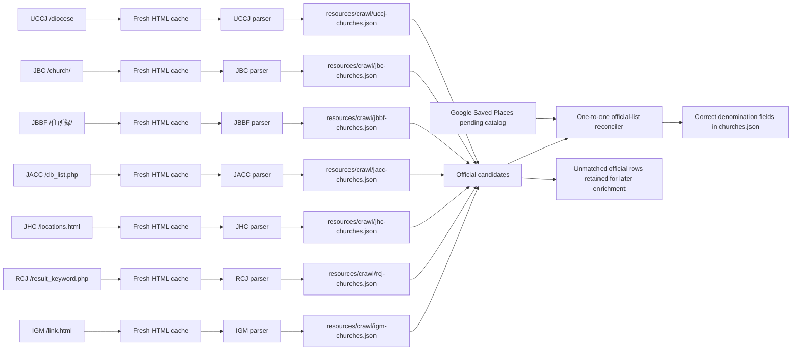

# Official denomination church-list crawlers

This package contains explicit parsers for authoritative church directories whose HTML structure needs stronger
validation than the generic CSS-selector crawler. The generated lists serve two purposes:

1. add official denomination evidence to a Google Saved Places church when the official row can be matched by
   normalized name plus postal/address evidence;
2. remove a programmatic denomination label when a fresh, complete official directory does not support it.

Human-reviewed denomination determinations always win. Official rows that cannot yet be joined to a complete
`ChurchRecord` remain in the generated list and `cache/cleanup/denomination-candidates.json`; they are not published
with invented coordinates or English names.

## Classes and data flow

- `DenominationChurchListCrawler` is the shared parser contract.
- `OfficialDenominationChurch`, `OfficialChurchMembershipStatus`, and `OfficialDenominationChurchList` are the
  serializable JSON model. A row marked as a pending applicant is retained for review but cannot establish membership.
- `UCCJDenominationChurchListCrawler` parses the `table.kyokai` rows from `https://uccj.org/diocese`.
- `JBCDenominationChurchListCrawler` parses the `table.church-table` rows from `https://bapren.jp/church/`.
- `JBBFDenominationChurchListCrawler` parses the `<p>` elements with postal codes from `https://jbbf.or.jp/住所録/`.
- `JACCDenominationChurchListCrawler` parses the multi-row table from `https://db.jacc.info/database/db_list.php`.
- `JHCDenominationChurchListCrawler` parses the 8-column tables from `https://jhc.or.jp/churches/locations.html`.
- `RCJDenominationChurchListCrawler` parses the `<section>` elements from `https://www.rcj.gr.jp/_church_list/result_keyword.php`.
- `IGMDenominationChurchListCrawler` parses the `<table>` with `<th>/<td>` rows from `https://www.immanuel.or.jp/link.html`.
- `JAGDenominationChurchListCrawler` aggregates the church cards from all 24 regional and paginated directory pages under `https://j-ag.org/church-info/`.
- `CachedHttpDenominationChurchPageLoader` stores current HTML and fetch metadata under
  `cache/denomination-church-lists/<denomination>/`.
- `DenominationChurchListCrawlerRunner` invalidates requested caches, loads a page, parses and validates rows, and
  atomically writes `resources/crawl/uccj-churches.json`, `resources/crawl/jbc-churches.json`, `resources/crawl/jbbf-churches.json`,
  `resources/crawl/jacc-churches.json`, `resources/crawl/jhc-churches.json`, `resources/crawl/rcj-churches.json`, or `resources/crawl/igm-churches.json`.
- `OfficialDenominationChurchListReconciler` performs address-aware, one-official-row-to-one-catalog-record matching.
  It assigns supported memberships, clears unsupported programmatic labels, and preserves human overrides.
- `OfficialDenominationChurchListPipeline` runs both explicit crawlers, replaces stale UCCJ/JBC candidate evidence,
  optionally runs the generic crawlers for other denominations, and reconciles the pending or canonical catalog.



Run all dedicated crawlers fresh and reconcile the catalog with:

```shell
./gradlew :crawl:run --args='crawl-denomination-directories --force-refresh --dedicated-only'
```

## Denomination coverage progress:

### SinglePageDenominationChurchListCrawler
- [x] UCCJ 日本基督教団
- [x] JBC 日本バプテスト連盟
- [x] JACC 日本同盟基督教団
- [x] JHC 日本ホーリネス教団
- [x] RCJ 日本キリスト改革派教会
- [x] JBBC 日本バプテスト・バイブル・フェローシップ
- [x] IGM イムマヌエル綜合伝道団


### MultiPageDenominationChurchListCrawler
- [x] JAG 日本アッセンブリーズ・オブ・ゴッド教団
- https://j-ag.org/church-info/hokkaido-kyoku/
- https://j-ag.org/church-info/hokkaido-kyoku/page/2/
- https://j-ag.org/church-info/tohoku-kyoku/
- https://j-ag.org/church-info/tohoku-kyoku/page/2/
- https://j-ag.org/church-info/kantohokuto-kyoku/
- https://j-ag.org/church-info/kantohokuto-kyoku/page/2/
- https://j-ag.org/church-info/kantohokuto-kyoku/page/3/
- https://j-ag.org/church-info/kantohokuto-kyoku/page/4/
- https://j-ag.org/church-info/kantonansei-kyoku/
- https://j-ag.org/church-info/kantonansei-kyoku/page/2/
- https://j-ag.org/church-info/kantonansei-kyoku/page/3/
- https://j-ag.org/church-info/kantonansei-kyoku/page/4/
- https://j-ag.org/church-info/tokai-kyoku/
- https://j-ag.org/church-info/tokai-kyoku/page/2/
- https://j-ag.org/church-info/hokuriku-kyoku/
- https://j-ag.org/church-info/hokuriku-kyoku/page/2/
- https://j-ag.org/church-info/kansai-kyoku/
- https://j-ag.org/church-info/kansai-kyoku/page/2/
- https://j-ag.org/church-info/kansai-kyoku/page/3/
- https://j-ag.org/church-info/kansai-kyoku/page/4/
- https://j-ag.org/church-info/chugoku-kyoku/
- https://j-ag.org/church-info/kyushu-kyoku/
- https://j-ag.org/church-info/kyushu-kyoku/page/2/
- https://j-ag.org/church-info/okinawa-kyoku/


### TODO list of denomination order by the church count
- [ ] カトリック中央協議会
- [ ] 日本聖公会

- [ ] イエス之御霊教会教団
- [ ] 日本福音キリスト教会連合
- [ ] セブンスデー・アドベンチスト教団
- [ ] 日本キリスト教会
- [ ] 日本イエス・キリスト教団
- [ ] 日本福音ルーテル教会
- [ ] The Light of Eternal Agape
- [ ] 聖イエス会
- [ ] 在日大韓基督教会
- [ ] 日本フルゴスペル教団
- [ ] 保守バプテスト同盟
- [ ] 日本ナザレン教団
- [ ] 日本バプテスト同盟
- [ ] 日本長老教会
- [ ] 単立ペンテコステ教会フェローシップ
- [ ] 日本福音自由教会協議会
- [ ] 基督兄弟団
- [ ] 日本バプテスト教会連合
- [ ] 日本ハリストス正教会教団
- [ ] 福音伝道教団
- [ ] 救世軍
