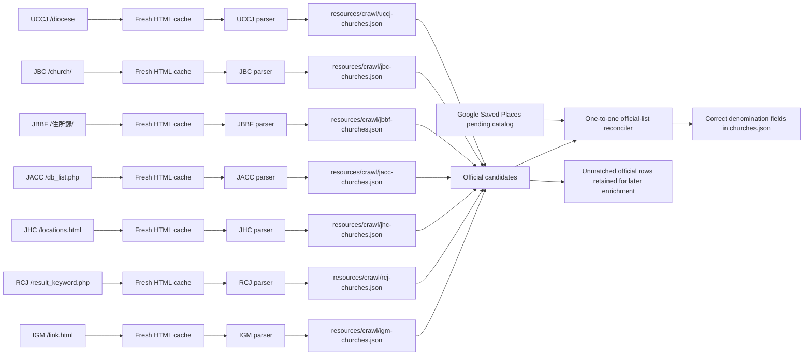

# Official denomination church-list crawlers

This package contains explicit parsers for authoritative church directories whose HTML structure needs stronger
validation than the generic CSS-selector crawler. The generated lists serve two purposes:

1. add official denomination evidence to a Google Saved Places church when the official row can be matched by
   normalized name plus postal/address evidence;
2. remove a programmatic denomination label when a fresh, complete official directory does not support it.

Human-reviewed denomination determinations always win. Official rows that cannot yet be joined to a complete
`ChurchRecord` remain in the generated list and `cache/cleanup/denomination-candidates.json`; they are not published
with invented coordinates or English names.

## Classes and data flow

- `DenominationChurchListCrawler` is the shared parser contract, specialized as
  `SinglePageDenominationChurchListCrawler` and `MultiPageDenominationChurchListCrawler`.
- `OfficialDenominationChurch`, `OfficialChurchMembershipStatus`, and `OfficialDenominationChurchList` are the
  serializable JSON model. A row marked as a pending applicant is retained for review but cannot establish membership.
- `UCCJDenominationChurchListCrawler` parses the `table.kyokai` rows from `https://uccj.org/diocese`.
- `JBCDenominationChurchListCrawler` parses the `table.church-table` rows from `https://bapren.jp/church/`.
- `JBBFDenominationChurchListCrawler` parses the `<p>` elements with postal codes from `https://jbbf.or.jp/住所録/`.
- `JACCDenominationChurchListCrawler` parses the multi-row table from `https://db.jacc.info/database/db_list.php`.
- `JHCDenominationChurchListCrawler` parses the 8-column tables from `https://jhc.or.jp/churches/locations.html`.
- `RCJDenominationChurchListCrawler` parses the `<section>` elements from `https://www.rcj.gr.jp/_church_list/result_keyword.php`.
- `IGMDenominationChurchListCrawler` parses the `<table>` with `<th>/<td>` rows from `https://www.immanuel.or.jp/link.html`.
- `JAGDenominationChurchListCrawler` aggregates the church cards from all 24 regional and paginated directory pages under `https://j-ag.org/church-info/`.
- `JELC`, `JCC` (`CCJ` catalog ID), `SDAJP`, `TLEA`, and `HEJ` parse their single-page official directories.
- `JECA`, `JCCJ`, and `KCCJ` aggregate their regional or paginated official directories; KCCJ explicitly excludes
  the non-church institutions published after its church rows.
- `ChurchMinisterParser` records clergy names and structured roles with JA/EN/KO/PT/ID labels. The runner uses the
  personal-name dictionaries to add localized readings and the shared romaji-to-Hangul converter before reconciliation.
- `CachedHttpDenominationChurchPageLoader` stores current HTML and fetch metadata under
  `cache/denomination-church-lists/<denomination>/`.
- `DenominationChurchListCrawlerRunner` invalidates requested caches, loads a page, parses and validates rows, and
  atomically writes `resources/crawl/uccj-churches.json`, `resources/crawl/jbc-churches.json`, `resources/crawl/jbbf-churches.json`,
  `resources/crawl/jacc-churches.json`, `resources/crawl/jhc-churches.json`, `resources/crawl/rcj-churches.json`, or `resources/crawl/igm-churches.json`.
- `OfficialDenominationChurchListReconciler` performs address-aware, one-official-row-to-one-catalog-record matching.
  It assigns supported memberships, clears unsupported programmatic labels, and preserves human overrides.
- `OfficialDenominationChurchListPipeline` runs both explicit crawlers, replaces stale UCCJ/JBC candidate evidence,
  optionally runs the generic crawlers for other denominations, and reconciles the pending or canonical catalog.



Run all dedicated crawlers fresh and reconcile the catalog with:

```shell
./gradlew :crawl:run --args='crawl-denomination-directories --force-refresh --dedicated-only'
```

## TODO Denomination coverage progress:

### SinglePageDenominationChurchListCrawler
- [x] UCCJ 日本基督教団 - https://uccj.org/diocese
- [x] JBC 日本バプテスト連盟 - https://bapren.jp/church/
- [x] JACC 日本同盟基督教団 - https://db.jacc.info/database/db_list.php
- [x] JHC 日本ホーリネス教団 - https://jhc.or.jp/churches/locations.html
- [x] RCJ 日本キリスト改革派教会 - https://www.rcj.gr.jp/_church_list/result_keyword.php
- [x] JBBF 日本バプテスト・バイブル・フェローシップ - https://jbbf.or.jp/%E4%BD%8F%E6%89%80%E9%8C%B2/
- [x] IGM イムマヌエル綜合伝道団 - https://www.immanuel.or.jp/link.html
- [x] JELC 日本福音ルーテル教会 https://jelc.or.jp/all_churchs/
- [x] CCJ 日本キリスト教会 http://www.nikki-church.org/data.htm
- [x] SDA_JP セブンスデー・アドベンチスト教団 https://adventist.jp/%E6%95%99%E4%BC%9A%E6%89%80%E5%9C%B0/%E6%95%99%E4%BC%9A%E4%B8%80%E8%A6%A7/
- [x] TLEA The Light of Eternal Agape https://tlea.tokyoantioch.com/ourchurch/all-tlea-link/
- [x] HEJ 聖イエス会 https://seiiesukai.org/branch/

- [x] FGJA 日本フルゴスペル教団 https://www.fgtc.jp/fullgospeltokyo/sanctuary-church.html
but excluding:
  東ロシア地方会	フルゴスペルウラジオストック教会	李 ミラン 牧師	ShilKinskaya Street 15-457
  Vladivostok,690066 Rep. of Russia
  Tel:7-914-662-5538
  東ロシア地方会	フルゴスペルハバロフスク教会	アンドレイ バトル牧師	PereulokBlagodatnui 37-A
  Khabarovsk, 680014 Rep. of Russia
  Tel:7-4212-35-1406
  東ロシア地方会	フルゴスペルサハリン教会	崔 ジンヒョック 牧師	Sakhalinskaya 198 Yuzhno-Sakhalinsk,
  Sakhalin Oblast 693000 Rep. of Russia
  Tel:7-4242-77-2357
  東ロシア地方会	フルゴスペルパルチザンスク教会	マカイ　ヤニカ 牧師	Zamaraeva, 17.
  Primorsky kray Partizansk, 692864 Rep. of Russia
  Tel:7-9147-37-6736

- [x] COTN_JP 日本ナザレン教団 http://www.nazarene.or.jp/cm/index.html
- [x] JBU 日本バプテスト同盟 http://www.jbu.or.jp/chs/
- [x] TPKF 単立ペンテコステ教会フェローシップ https://tpkf.org/localch_group.html
- [x] BCC 基督兄弟団 https://kyodaidan.org/church/
- [x] BGC_JP 日本バプテスト教会連合 https://rengo.ne.jp/chruch-list/
- [x] SA_JP 救世軍 https://www.salvationarmy.or.jp/about-org/chapel/
- [x] HPBC Hawaii Pacific Baptist Convention - https://www.hpbaptist.net/location/asia/
- [x] NSKK 日本聖契キリスト教団 - https://nskk.gr.jp/church/
- [x] ADVENT 日本アドベント・キリスト教団 - https://nihonadobento.wordpress.com/home/%e6%89%80%e5%b1%9e%e6%95%99%e4%bc%9a%e3%83%bb%e9%96%a2%e9%80%a3%e5%9b%a3%e4%bd%93%e4%b8%80%e8%a6%a7/
- [x] FUKUIN_DENDO 日本伝道福音教団 - https://church.ne.jp/niigatabible_ch/main/denpuku.html
- [x] JEB 日本伝道隊 - https://nihon-dendoutai.kyoukai.jp/church/
- [x] SEIYAKU 日本聖約キリスト教団 - http://www.seiyaku.jp/
- [x] JECU 日本福音教会連合 - https://church.ne.jp/jecu/link.htm
- [x] JBA 日本バプテスト連合 - https://www.jbaptist.org/blank-2
- [x] MENNONITE_BRETHREN_COUNCIL_JP 日本メノナイト・キリスト教会協議会 - https://www.mennonite.jp/church/
- [x] CHRIST_EVANGELIZATION_TEAM キリスト伝道隊 - https://dendoutai.org/churches/
- [x] COG_JP チャーチ・オブ・ゴッド - https://www.cogjapan.com/2515223646259452025012539125111249112473124881252212540.html
- [x] SFDK 世界福音伝道会 - https://www.sfdk.org/
- [x] CCG カルバリーチャペルグループ - https://www.yamatocalvarychapel.com/service/branch_01.php
- [x] GFA 福音交友会 - http://fkk-web.net/church/church.html
- [x] IEC インドネシア福音教会 - https://www.giii-japan.org/gereja-wilayah
- [x] CCMJ カルバリーチャペルミニストリー JAPAN - http://www.calvaryjapan.com/
- [x] KECCJCC カンバーランド長老キリスト教会日本中会 - https://www.cumberland.jp/introduction/
- [x] JCGF 日本神の教会連盟 - http://xn--u9j463geip7pa94cc38by5dpv1d.com/
- [x] JCGA 日本チャーチオブゴッド教団 - https://www.japanchurchofgod.org/family
- [x] JGPC 日本福音ペンテコステ教団 - https://jgpc.jimdofree.com/%E6%95%99%E4%BC%9A%E4%B8%80%E8%A6%A7/
- [x] BIBLE_CHURCH_FEDERATION 聖書教会連盟 - http://www.kyoukai.com/rennmei/syo/hp/1ran.html
- [x] JAM 日本アライアンス・ミッション - https://japanalliancemission.org/info/alliance-church-network/
- [x] TFMC 東京フリー・メソジスト教団 - https://tokyofree.net/
- [x] JMCC 日本メノナイト・キリスト教会会議 - https://mennonite.jpn.org/
- [x] LECC ルーテル福音キリスト教会 - https://www.leccjapan.com/churches
- [x] JSCCF 日本聖泉基督教会連合 - https://seisen-rengou.blogspot.com/2012/02/blog-post_22.html
- [x] ENCJ エブリネイションチャーチズジャパン - https://everynation.jp/directory/
- [x] JOAC 日本オリベットアッセンブリー教団（公式ページが自動取得を HTTP 403 で拒否するため、2026-07-14 の公式ページ保存版からコミットした `resources/crawl/joac-churches.html` を使用） - https://olivetassembly.or.jp/our-regions.html
- [x] JCUC 日本キリスト合同教会 - https://godo.or.jp/churches/
- [x] TJC 真イエス教会 - https://www.tjc.or.jp/churchIndex#main
- [x] OCCJ 日本華僑基督教団 - https://www.occj.net/church
- [x] JFMC 日本自由メソヂスト教団 - https://methodist-free.jp/
- [x] QUAKER_JP キリスト友会日本年会 - https://quakerjapan.wixsite.com/tokyogekkai/about-us
- [x] CHRISTIAN_FELLOWSHIP キリスト同信会（大阪集会の旧会堂住所は、公式ページが解体済みと明記しているため収録しない） - https://nakano-psc.org/about/other_area/
- [x] BCA ベタニヤ・クリスチャン・アッセンブリーズ（Shift_JIS ページ。保見キリスト教会の誤記郵便番号 407-0355 を 470-0355 に補正） - https://church.ne.jp/bethany/assemblies.html
- [x] NLCCU 新生キリスト教会連合（町田クリスチャンセンターは現行フッターの中町住所を採用） - https://mccjapa8.wixsite.com/mccjapan/--c1k3t
- [x] JVCF 日本ヴィンヤード・クリスチャン・フェロシップ - https://worship.vcfkani.org/introduction/
- [x] JMS 日本宣教会（喜多見チャペルは会場変動の公式案内に従い、旧固定会場住所を収録しない） - https://nihonsenkyoukai.com/our-churches/

### MultiPageDenominationChurchListCrawler
- [x] CCNZ チャーチオブクライストニュージーランド日本 - https://www.ccnz.jp/group/
- https://www.ccnz.jp/church/access.html
- [x] JAG 日本アッセンブリーズ・オブ・ゴッド教団 - https://j-ag.org/church-info/
- https://j-ag.org/church-info/hokkaido-kyoku/
- https://j-ag.org/church-info/hokkaido-kyoku/page/2/
- https://j-ag.org/church-info/tohoku-kyoku/
- https://j-ag.org/church-info/tohoku-kyoku/page/2/
- https://j-ag.org/church-info/kantohokuto-kyoku/
- https://j-ag.org/church-info/kantohokuto-kyoku/page/2/
- https://j-ag.org/church-info/kantohokuto-kyoku/page/3/
- https://j-ag.org/church-info/kantohokuto-kyoku/page/4/
- https://j-ag.org/church-info/kantonansei-kyoku/
- https://j-ag.org/church-info/kantonansei-kyoku/page/2/
- https://j-ag.org/church-info/kantonansei-kyoku/page/3/
- https://j-ag.org/church-info/kantonansei-kyoku/page/4/
- https://j-ag.org/church-info/tokai-kyoku/
- https://j-ag.org/church-info/tokai-kyoku/page/2/
- https://j-ag.org/church-info/hokuriku-kyoku/
- https://j-ag.org/church-info/hokuriku-kyoku/page/2/
- https://j-ag.org/church-info/kansai-kyoku/
- https://j-ag.org/church-info/kansai-kyoku/page/2/
- https://j-ag.org/church-info/kansai-kyoku/page/3/
- https://j-ag.org/church-info/kansai-kyoku/page/4/
- https://j-ag.org/church-info/chugoku-kyoku/
- https://j-ag.org/church-info/kyushu-kyoku/
- https://j-ag.org/church-info/kyushu-kyoku/page/2/
- https://j-ag.org/church-info/okinawa-kyoku/

- [x] JECA 日本福音キリスト教会連合 - https://jeca.jp/church/church/hokkaido.html
- https://jeca.jp/church/church/hokkaido.html
- https://jeca.jp/church/church/touhoku.html
- https://jeca.jp/church/church/kitakanto.html
- https://jeca.jp/church/church/nakakanto.html
- https://jeca.jp/church/church/nishikanto.html
- https://jeca.jp/church/church/minamikanto.html
- https://jeca.jp/church/church/chubu.html
- https://jeca.jp/church/church/nisinippon.html
- https://jeca.jp/church/code/nisinippon.html
- https://jeca.jp/church/code/nisinippon.html
- https://jeca.jp/church/church/okinawa.html

- [x] JCCJ 日本イエス・キリスト教団 - https://jccj.info/localchurch_tyokkatu.php
- https://jccj.info/localchurch_tyokkatu.php
- https://jccj.info/localchurch_touhoku.php
- https://jccj.info/localchurch_kanto.php
- https://jccj.info/localchurch_shinetu.php
- https://jccj.info/localchurch_kyoto.php
- https://jccj.info/localchurch_osaka.php
- https://jccj.info/localchurch_hyogo.php
- https://jccj.info/localchurch_tyugoku.php
- https://jccj.info/localchurch_shikoku.php
- https://jccj.info/localchurch_kyusyu.php

- [x] KCCJ 在日大韓基督教会 - https://kccj.jp/church_list.php
- https://kccj.jp/church_list.php
- https://kccj.jp/church_list.php?page=2&chihokai=&keyfield=&key=
- https://kccj.jp/church_list.php?page=3&chihokai=&keyfield=&key=
- https://kccj.jp/church_list.php?page=4&chihokai=&keyfield=&key=
but exclude following none-church entities:
22	 総会事務局	総幹事 金柄鎬	03−3202−5398	〒169-0051 東京都新宿区西早稲田 2−3−18−55
21	 在日韓国基督教会館	名誉館長 李清一	06-6731-6801	〒544-0032 大阪府大阪市生野区中川西 2−6−10
20	 在日韓国人問題研究所(RAIK)	所長 佐藤信行	03−3203−7575	〒169-0051 東京都新宿区西早稲田 2−3−18−52
19	 西南KCC	主事 朱文洪	093−521−7271	〒802-0015 福岡県北九州市小倉北区大田町 14−31
18	 全国教会女性連合会	総務 石橋真理恵	06−6731−3939	〒544-0032 大阪府大阪市生野区中川西 2−6−10KCC内
17	 在日総会神学校		03−3899−9861	〒123-0845 東京都足立区西新井本町 4−5−1
16	 関西聖書神学院		06−6371−1914	〒531-0074 大阪府大阪市北区本庄東 2−11−6
15	 在日本韓国基督教青年会(YMCA)	総務 朱宰亨	03−3233−0611	〒101-0064 東京都千代田区神田猿楽町 2−5−5
14	 関西韓国YMCA		06-6981-0781	〒537-0025 大阪府大阪市東成区中道 3−14−15
13	 桜本保育園		044−288−2545	〒210-0833 神奈川県川崎市川崎区桜本 1−8−22
12	 打越保育園		045−252−8027	〒231-0867 神奈川県横浜市中区打越 39
11	 永信保育園		052−571−0924	〒450-0002 愛知県名古屋市中村区名駅 2−39−11
10	 向上社保育園		075−311−3606	〒615-0026 京都府京都市右京区西院北矢掛町 22
9	 向上社児童館		075−313−0939	〒615-0026 京都府京都市右京区西院北矢掛町 22
8	 愛信保育園		06−6712−2020	〒544-0032 大阪府大阪市生野区中川西 2−5−15
7	 イカイノ保育園		06−6731−3535	〒544-0032 大阪府大阪市生野区中川西 2−6−10
6	 サカエ保育園		06−6414−2488	〒660-0055 兵庫県尼崎市稲葉元町 3−10−7
5	 永生苑		052−541−3780	〒450-0002 愛知県名古屋市中村区名駅 2−39−11
4	 永生苑新明		052−533−7177	〒450-0002 愛知県名古屋市中村区名駅 3−3−10
3	 永生苑豊橋		0532−55−5011	〒440-0081 愛知県豊橋市大村町 83
2	 ケアハウスセットンの家		072−272−8338	〒590-0142 大阪府堺市南区檜尾 3360−10
1	 精神障害碍者支援に取り組む「社会福祉法人サワリ」

- [x] JCBA 保守バプテスト同盟 - https://doumei.holy.jp/churches/
- https://doumei.holy.jp/churches/%e9%9d%92%e6%a3%ae%e7%9c%8c%e3%83%bb%e5%b2%a9%e6%89%8b%e7%9c%8c%e3%83%bb%e7%a7%8b%e7%94%b0%e7%9c%8c/
- https://doumei.holy.jp/churches/%e5%ae%ae%e5%9f%8e%e7%9c%8c/
- https://doumei.holy.jp/churches/%e5%b1%b1%e5%bd%a2%e7%9c%8c/
- https://doumei.holy.jp/churches/%e7%a6%8f%e5%b3%b6%e7%9c%8c%e5%8c%97%e9%96%a2%e6%9d%b1/
- https://doumei.holy.jp/churches/%e9%a6%96%e9%83%bd%e5%9c%8f%e9%95%b7%e5%b4%8e%e7%9c%8c/
The church list includes social links. so reconcile with the data from exported google saved places/youtube/facebook/instagram/x.com

- [x] PCJ 日本長老教会 https://chorokyokai.jp/churches/
each "church detail webpage of denomination official website" needs to be crawled to get more detail chruch info such as pastor name, email, address, website, etc.

- [x] EFC_JP 日本福音自由教会協議会 https://efcj.org/churchlist
  each "church detail webpage of denomination official website" needs to be crawled to get more detail chruch info such as pastor name, email, address, website, etc.

- [x] GEC 福音伝道教団 - https://fukuindendou.org/
- https://fdk.fukuindendou.org/gunma/
- https://fdk.fukuindendou.org/saitama/
- https://fdk.fukuindendou.org/tochigi/
- https://fdk.fukuindendou.org/tokyo-kanagawa/


- [x] CATHOLIC_JP カトリック中央協議会 - https://www.cbcj.catholic.jp/map/index.php/
- [x] ANGLICAN_JP 日本聖公会 - https://www.nskk.org/tokyo/churchs/list
- [x] ORTHODOX_JP 日本ハリストス正教会教団 - https://www.orthodoxjapan.jp/area-tokyo.html
- [x] JMA 日本宣教連合会 - https://japanmissionassociation.org/
- [x] WJELC 西日本福音ルーテル教会 - https://www.wjelc.or.jp/
- [x] JAC 日本アライアンス教団 - http://jac-hij.sakura.ne.jp/
- [x] WHCJ ウェスレアン・ホーリネス教団（コミット済み `resources/crawl/whcj-churches.html`） - https://whchurch.jimdo.com/
- [x] OBC 沖縄バプテスト連盟（公式英語名を canonical record に反映） - http://okinawabaptist.com/
- [x] JMBC 日本メノナイトブレザレン教団（公式英語名を canonical record に反映） - https://jmbc.japan-mb.com/
- [x] SEIKYODAN 基督聖協団（フレーム本体 `shyozoku5.html` を直接取得） - http://www.seikyodan.com/shyozoku5.html
- [x] WMC ワールドミッション教団 - https://worldmission.or.jp/
- [x] JLBC 日本ルーテル同胞教団 - https://clbj.org/
- [x] FMC_JP 日本フリーメソジスト教団 - http://fmcjp.org/
- [x] NFK 日本福音教団（半角カナの韓国人名読みを分離し、ハングル名を保持） - https://nihonfukuin.imagodei.jp/
- [x] JEC 日本福音教会 - https://www.jec-net.org/
- [x] JFGC 日本フォースクエア福音教団 - https://www.japan-foursquare.jp/
- [x] JLC 日本ルーテル教団 - http://www.jlc.or.jp/
- [x] JFEC 同盟福音基督教会 - http://www.doumeifukuin.net/
- [x] KELC 近畿福音ルーテル教会 - http://www.kelc.net/
- [x] LIVE ライブチャーチ - https://livechurch.jp/
- [x] GMI グレース宣教会 - https://gmi.or.jp/chapels/


### backlog of denomination order by the church count
 - [ ] JAPAN_FREE_EVANGELICAL_CHURCH 日本自由福音教団 - https://njfk-jp.com/
- [ ] MINO_MISSION 美濃ミッション - https://www.cty-net.ne.jp/~mmi/church.html
- [ ] ECC エバンジェリカル・コングリゲーショナル・チャーチ - https://gracegardenchurch.com/introduction/overview/
- [ ] CBA キリスト信徒の集会 - https://ja.wikipedia.org/wiki/%E3%82%AD%E3%83%AA%E3%82%B9%E3%83%88%E4%BF%A1%E5%BE%92%E3%81%AE%E9%9B%86%E4%BC%9A
- [ ] JAPAN_BETHEL_MISSION 日本べテルミッション - https://japanbethelmission.com/
- [ ] EGM 東洋福音教団 - https://ja.wikipedia.org/wiki/%E6%9D%B1%E6%B4%8B%E7%A6%8F%E9%9F%B3%E6%95%99%E5%9B%A3
- [ ] BSF 聖書研究会 - https://skk-jpn.com/
- [ ] AJBMM 全日本バプテスト・ミド・ミッション - https://bmmjapan.org/
- [ ] JCA 日本基督会 - https://shibuya-kirisutokai.la.coocan.jp/nihonkirisutokai.htm
- [ ] THC 東京ホライズンチャペル - https://horizonchapel.jp/service
- [ ] GBF 福音バプテスト連合 - https://ja.wikipedia.org/wiki/%E7%A6%8F%E9%9F%B3%E3%83%90%E3%83%97%E3%83%86%E3%82%B9%E3%83%88%E9%80%A3%E5%90%88
- [ ] ICM インターナショナル・チャペル・ミニストリーズ - https://www.ikomachapel.org/iic%E3%81%AB%E3%81%A4%E3%81%84%E3%81%A6
- [ ] BEMS バルナバ福音宣教会 - https://barnabas-missionary.amebaownd.com/
- [ ] YWAM ユース･ウィズ･ア･ミッション - https://www.ywamjapan.org/ja/
- [ ] JNAC 日本新使徒教会 - https://www.accjapan.org/

### if the church group is not an organization, or if the orgnaization does not have website, in those cases, we need to skip trying to create denomination specific crawlers and they will be added here:

- [SKIPPED] BIBLE_CHRISTIAN_ASSOCIATION 聖書キリスト教会 - the supplied official site is the Tokyo congregation website and publishes no organization church list
- [SKIPPED] ICHIBAKU 活けるキリスト一麦の群 - the supplied official site is the local 一麦教会 website and publishes no member-church list
- [SKIPPED] OBC_JP 日本オープンバイブル教団 - the official site says 19 churches exist but publishes only seven leadership churches, not a complete member-church list
- [SKIPPED] JBM 日本バプテスト宣教団 - the official site describes a missionary support organization and regional teams but publishes no member-church directory
- [SKIPPED] JEMS_ASSOCIATION 日本福音宣教会 - the official site describes evangelism, broadcasting, publications, overseas support, and conferences but publishes no member-church directory
- [SKIPPED] NEW_HOPE_ASIA_JP ニューホープ・インターナショナル・アジア・ジャパン - the official New Hope Tokyo site publishes only its own congregation and a related-links page containing one satellite church, not the network's complete member-church directory
- [SKIPPED] JFWB 福音バプテスト宣教団 - the official site publishes news, event posts, and contact information but no member-church directory
- [SKIPPED] VCG 勝利教会グループ - the supplied official page contains no church directory; the official introduction says eight chapels existed in 2022 but does not identify the individual chapels
- [SKIPPED] RCC 復活之キリスト教団 - the supplied source is Wikipedia, and the source registry contains neither an official organization website nor an official member-church directory
- [SKIPPED] JESUS_EVANGELICAL_CHURCH イエス福音教団 - the supplied source is Wikipedia, and the source registry contains neither an official organization website nor an official member-church directory
- [SKIPPED] JCB 日本キリスト兄弟団 - the supplied source is Wikipedia, and the source registry contains neither an official organization website nor an official member-church directory
- [SKIPPED] JJWM イエス教日本世界宣教会 - the supplied source is Wikipedia, and the source registry contains neither an official organization website nor an official member-church directory
- [SKIPPED] SJC イエス之御霊教会教団 - no official website
- [SKIPPED] CHRISTIAN_CHURCHES キリストの教会（クリスチャン・チャーチ系） - not a denomination organization
- [SKIPPED] CHURCHES_OF_CHRIST キリストの教会（無楽器派） - not a denomination organization
- [SKIPPED] UPC_JP 日本ユナイテッド・ペンテコステ教団 - no official website
- [SKIPPED] ELCMC 東洋ローア・キリスト伝道教会 - no official website
- [SKIPPED] NCG 無教会主義集会 - not a denomination organization
- [SKIPPED] JRL 日本リバイバル連盟 - no official website
- [SKIPPED] NTM 日本ネクスト・タウンズ・ミッション - no official website
- [SKIPPED] JPC 日本ペンテコステ教団 - no official website
- [SKIPPED] YUAI 友愛グループ教会連合 - no official website
- [SKIPPED] JFDA 日本フェローシップ・ディコンリー伝道会 - no official website
- [SKIPPED] SCMS 札幌キリスト召団 - no official website
- [SKIPPED] FGCC 神の家族キリスト教会 - no official website
- [SKIPPED] MFK 萬国福音教団 - no official website
- [SKIPPED] JCGG イエス・キリスト福音の群 - no official website
- [SKIPPED] BFG ブレッシング・フェローシップ・グループ - no official website
- [SKIPPED] KPCJ 大韓イエス教長老会 - no official website
- [SKIPPED] GGCC 栄光の福音キリスト教団 - no official website
- [SKIPPED] TCCG ト－タル・クリスチャン・チャ－チグループ - no official website
- [SKIPPED] BFS 聖書友の会 - no official website
- [SKIPPED] ALLIES_5 アライズ5 - no official website
- [SKIPPED] CCA 基督教カナン教団 - no official website
- [SKIPPED] JBCF キリスト教日本バプテスト会(連盟) - no official website
- [SKIPPED] CLC ｸﾘｽﾁｬﾝ・ﾗｲﾌ・ﾁｬｰﾁｽﾞ・ｲﾝﾀｰﾅｼｮﾅﾙ - no official website
- [SKIPPED] ZCF シオン・クリスチャン・フェロシップ - no official website
- [SKIPPED] JCC 日本キリストの教会 - no official website
- [SKIPPED] ZCA シオン・キリスト教団 - no official website
- [SKIPPED] RPJ 日本キリスト改革長老教会 - no official website
- [SKIPPED] JBPCC 日本バイブル・プロテスタント基督教会 - no official website
- [SKIPPED] JEMS_MISSION 日本福音宣教団 - no official website
- [SKIPPED] CEG キリスト伝道団 - no official website
- [SKIPPED] ZION_MISSION シオン宣教団 - no official website
- [SKIPPED] KKFF 九州キリスト福音フェローシップ - no official website
- [SKIPPED] OMS 東洋宣教団 - no official website
- [SKIPPED] IFGF インターナショナル・フルゴスペル・フェローシップ - no official website
- [SKIPPED] CGEC キリスト教ガリラヤ福音教団 - no official website
- [SKIPPED] ICEC キリスト教国際福音教団 - no official website
- [SKIPPED] ICC 国際基督教団 - no official website
- [SKIPPED] JAPAN_BETHESDA_CHURCH 日本ベテスダ教団 - no official website
- [SKIPPED] TDMCF 東京地区メノナイト教会連合 - no official website
- [SKIPPED] KEFA 関西福音交友会 - no official website
- [SKIPPED] SANBI_MISSION サンビ教団 - no official website
- [SKIPPED] JCM ジーザス・クライスト・ミニストリーズ - no official website
- [SKIPPED] JAPAN_BETHANY_MISSION ジャパン・ベサニー・ミッション - no official website
- [SKIPPED] JAPAN_APOSTOLIC_CHRISTIAN_CHURCH 日本使徒キリスト教会 - no official website
- [SKIPPED] JEBC 日本福音基督教団 - no official website
- [SKIPPED] OPCJM 正統長老教会日本ミッション - no official website
- [SKIPPED] FCWMS 藤原キリスト世界伝道団 - no official website
- [SKIPPED] CCC カルバリキリスト教団 - no official website
- [SKIPPED] SEGMJ 在日スエーデン東洋福音伝道団 - no official website
- [SKIPPED] INDEPENDENT_BAPTIST 単立バプテスト - not a denomination organization
- [SKIPPED] INDEPENDENT_CHURCH 単立 - not a denomination organization
