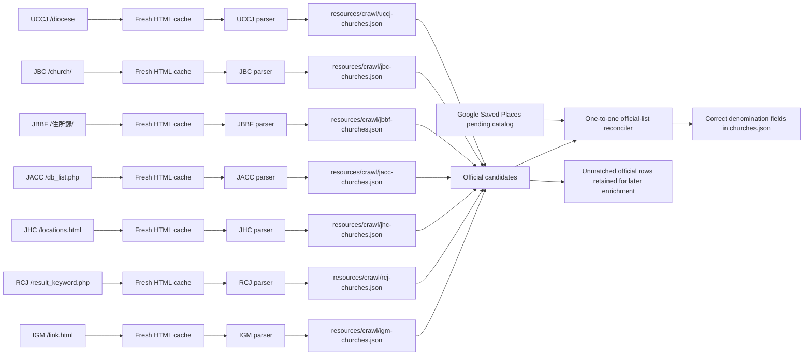

# Official denomination church-list crawlers

This package contains explicit parsers for authoritative church directories whose HTML structure needs stronger
validation than the generic CSS-selector crawler. The generated lists serve two purposes:

1. add official denomination evidence to a Google Saved Places church when the official row can be matched by
   normalized name plus postal/address evidence;
2. remove a programmatic denomination label when a fresh, complete official directory does not support it.

Human-reviewed denomination determinations always win. Official rows that cannot yet be joined to a complete
`ChurchRecord` remain in the generated list and `cache/cleanup/denomination-candidates.json`; they are not published
with invented coordinates or English names.

## Classes and data flow

- `DenominationChurchListCrawler` is the shared parser contract.
- `OfficialDenominationChurch`, `OfficialChurchMembershipStatus`, and `OfficialDenominationChurchList` are the
  serializable JSON model. A row marked as a pending applicant is retained for review but cannot establish membership.
- `UCCJDenominationChurchListCrawler` parses the `table.kyokai` rows from `https://uccj.org/diocese`.
- `JBCDenominationChurchListCrawler` parses the `table.church-table` rows from `https://bapren.jp/church/`.
- `JBBFDenominationChurchListCrawler` parses the `<p>` elements with postal codes from `https://jbbf.or.jp/住所録/`.
- `JACCDenominationChurchListCrawler` parses the multi-row table from `https://db.jacc.info/database/db_list.php`.
- `JHCDenominationChurchListCrawler` parses the 8-column tables from `https://jhc.or.jp/churches/locations.html`.
- `RCJDenominationChurchListCrawler` parses the `<section>` elements from `https://www.rcj.gr.jp/_church_list/result_keyword.php`.
- `IGMDenominationChurchListCrawler` parses the `<table>` with `<th>/<td>` rows from `https://www.immanuel.or.jp/link.html`.
- `JAGDenominationChurchListCrawler` aggregates the church cards from all 24 regional and paginated directory pages under `https://j-ag.org/church-info/`.
- `CachedHttpDenominationChurchPageLoader` stores current HTML and fetch metadata under
  `cache/denomination-church-lists/<denomination>/`.
- `DenominationChurchListCrawlerRunner` invalidates requested caches, loads a page, parses and validates rows, and
  atomically writes `resources/crawl/uccj-churches.json`, `resources/crawl/jbc-churches.json`, `resources/crawl/jbbf-churches.json`,
  `resources/crawl/jacc-churches.json`, `resources/crawl/jhc-churches.json`, `resources/crawl/rcj-churches.json`, or `resources/crawl/igm-churches.json`.
- `OfficialDenominationChurchListReconciler` performs address-aware, one-official-row-to-one-catalog-record matching.
  It assigns supported memberships, clears unsupported programmatic labels, and preserves human overrides.
- `OfficialDenominationChurchListPipeline` runs both explicit crawlers, replaces stale UCCJ/JBC candidate evidence,
  optionally runs the generic crawlers for other denominations, and reconciles the pending or canonical catalog.



Run all dedicated crawlers fresh and reconcile the catalog with:

```shell
./gradlew :crawl:run --args='crawl-denomination-directories --force-refresh --dedicated-only'
```

## TODO Denomination coverage progress:

### SinglePageDenominationChurchListCrawler
- [x] UCCJ 日本基督教団
- [x] JBC 日本バプテスト連盟
- [x] JACC 日本同盟基督教団
- [x] JHC 日本ホーリネス教団
- [x] RCJ 日本キリスト改革派教会
- [x] JBBC 日本バプテスト・バイブル・フェローシップ
- [x] IGM イムマヌエル綜合伝道団
- [ ] JELC 日本福音ルーテル教会 https://jelc.or.jp/all_churchs/
- [ ] JCC 日本キリスト教会 http://www.nikki-church.org/data.htm

- [ ] SDA_JP セブンスデー・アドベンチスト教団 https://adventist.jp/%E6%95%99%E4%BC%9A%E6%89%80%E5%9C%A8%E5%9C%B0/%E6%95%99%E4%BC%9A%E4%B8%80%E8%A6%A7/
- [ ] TLEA The Light of Eternal Agape https://tlea.tokyoantioch.com/ourchurch/all-tlea-link/
- [ ] HEJ 聖イエス会 https://seiiesukai.org/branch/

### MultiPageDenominationChurchListCrawler
- [x] JAG 日本アッセンブリーズ・オブ・ゴッド教団
- https://j-ag.org/church-info/hokkaido-kyoku/
- https://j-ag.org/church-info/hokkaido-kyoku/page/2/
- https://j-ag.org/church-info/tohoku-kyoku/
- https://j-ag.org/church-info/tohoku-kyoku/page/2/
- https://j-ag.org/church-info/kantohokuto-kyoku/
- https://j-ag.org/church-info/kantohokuto-kyoku/page/2/
- https://j-ag.org/church-info/kantohokuto-kyoku/page/3/
- https://j-ag.org/church-info/kantohokuto-kyoku/page/4/
- https://j-ag.org/church-info/kantonansei-kyoku/
- https://j-ag.org/church-info/kantonansei-kyoku/page/2/
- https://j-ag.org/church-info/kantonansei-kyoku/page/3/
- https://j-ag.org/church-info/kantonansei-kyoku/page/4/
- https://j-ag.org/church-info/tokai-kyoku/
- https://j-ag.org/church-info/tokai-kyoku/page/2/
- https://j-ag.org/church-info/hokuriku-kyoku/
- https://j-ag.org/church-info/hokuriku-kyoku/page/2/
- https://j-ag.org/church-info/kansai-kyoku/
- https://j-ag.org/church-info/kansai-kyoku/page/2/
- https://j-ag.org/church-info/kansai-kyoku/page/3/
- https://j-ag.org/church-info/kansai-kyoku/page/4/
- https://j-ag.org/church-info/chugoku-kyoku/
- https://j-ag.org/church-info/kyushu-kyoku/
- https://j-ag.org/church-info/kyushu-kyoku/page/2/
- https://j-ag.org/church-info/okinawa-kyoku/

- [ ] JECA 日本福音キリスト教会連合
- https://jeca.jp/church/church/hokkaido.html
- https://jeca.jp/church/church/touhoku.html
- https://jeca.jp/church/church/kitakanto.html
- https://jeca.jp/church/church/nakakanto.html
- https://jeca.jp/church/church/nishikanto.html
- https://jeca.jp/church/church/minamikanto.html
- https://jeca.jp/church/church/chubu.html
- https://jeca.jp/church/church/nisinippon.html
- https://jeca.jp/church/code/nisinippon.html
- https://jeca.jp/church/code/nisinippon.html
- https://jeca.jp/church/church/okinawa.html

- [ ] JCCJ 日本イエス・キリスト教団
- https://jccj.info/localchurch_tyokkatu.php
- https://jccj.info/localchurch_touhoku.php
- https://jccj.info/localchurch_kanto.php
- https://jccj.info/localchurch_shinetu.php
- https://jccj.info/localchurch_kyoto.php
- https://jccj.info/localchurch_osaka.php
- https://jccj.info/localchurch_hyogo.php
- https://jccj.info/localchurch_tyugoku.php
- https://jccj.info/localchurch_shikoku.php
- https://jccj.info/localchurch_kyusyu.php

- [ ] KCCJ 在日大韓基督教会
- https://kccj.jp/church_list.php
- https://kccj.jp/church_list.php?page=2&chihokai=&keyfield=&key=
- https://kccj.jp/church_list.php?page=3&chihokai=&keyfield=&key=
- https://kccj.jp/church_list.php?page=4&chihokai=&keyfield=&key=
but exclude following none-church entities:
22	 総会事務局	総幹事 金柄鎬	03−3202−5398	〒169-0051 東京都新宿区西早稲田 2−3−18−55
21	 在日韓国基督教会館	名誉館長 李清一	06-6731-6801	〒544-0032 大阪府大阪市生野区中川西 2−6−10
20	 在日韓国人問題研究所(RAIK)	所長 佐藤信行	03−3203−7575	〒169-0051 東京都新宿区西早稲田 2−3−18−52
19	 西南KCC	主事 朱文洪	093−521−7271	〒802-0015 福岡県北九州市小倉北区大田町 14−31
18	 全国教会女性連合会	総務 石橋真理恵	06−6731−3939	〒544-0032 大阪府大阪市生野区中川西 2−6−10KCC内
17	 在日総会神学校		03−3899−9861	〒123-0845 東京都足立区西新井本町 4−5−1
16	 関西聖書神学院		06−6371−1914	〒531-0074 大阪府大阪市北区本庄東 2−11−6
15	 在日本韓国基督教青年会(YMCA)	総務 朱宰亨	03−3233−0611	〒101-0064 東京都千代田区神田猿楽町 2−5−5
14	 関西韓国YMCA		06-6981-0781	〒537-0025 大阪府大阪市東成区中道 3−14−15
13	 桜本保育園		044−288−2545	〒210-0833 神奈川県川崎市川崎区桜本 1−8−22
12	 打越保育園		045−252−8027	〒231-0867 神奈川県横浜市中区打越 39
11	 永信保育園		052−571−0924	〒450-0002 愛知県名古屋市中村区名駅 2−39−11
10	 向上社保育園		075−311−3606	〒615-0026 京都府京都市右京区西院北矢掛町 22
9	 向上社児童館		075−313−0939	〒615-0026 京都府京都市右京区西院北矢掛町 22
8	 愛信保育園		06−6712−2020	〒544-0032 大阪府大阪市生野区中川西 2−5−15
7	 イカイノ保育園		06−6731−3535	〒544-0032 大阪府大阪市生野区中川西 2−6−10
6	 サカエ保育園		06−6414−2488	〒660-0055 兵庫県尼崎市稲葉元町 3−10−7
5	 永生苑		052−541−3780	〒450-0002 愛知県名古屋市中村区名駅 2−39−11
4	 永生苑新明		052−533−7177	〒450-0002 愛知県名古屋市中村区名駅 3−3−10
3	 永生苑豊橋		0532−55−5011	〒440-0081 愛知県豊橋市大村町 83
2	 ケアハウスセットンの家		072−272−8338	〒590-0142 大阪府堺市南区檜尾 3360−10
1	 精神障害碍者支援に取り組む「社会福祉法人サワリ」


### backlog of denomination order by the church count
- [ ] カトリック中央協議会
- [ ] 日本聖公会
- [ ] イエス之御霊教会教団
- [ ] 日本フルゴスペル教団
- [ ] 保守バプテスト同盟
- [ ] 日本ナザレン教団
- [ ] 日本バプテスト同盟
- [ ] 日本長老教会
- [ ] 単立ペンテコステ教会フェローシップ
- [ ] 日本福音自由教会協議会
- [ ] 基督兄弟団
- [ ] 日本バプテスト教会連合
- [ ] 日本ハリストス正教会教団
- [ ] 福音伝道教団
- [ ] 救世軍
