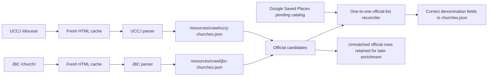

# Official denomination church-list crawlers

This package contains explicit parsers for authoritative church directories whose HTML structure needs stronger
validation than the generic CSS-selector crawler. The generated lists serve two purposes:

1. add official denomination evidence to a Google Saved Places church when the official row can be matched by
   normalized name plus postal/address evidence;
2. remove a programmatic denomination label when a fresh, complete official directory does not support it.

Human-reviewed denomination determinations always win. Official rows that cannot yet be joined to a complete
`ChurchRecord` remain in the generated list and `cache/cleanup/denomination-candidates.json`; they are not published
with invented coordinates or English names.

## Classes and data flow

- `DenominationChurchListCrawler` is the shared parser contract.
- `OfficialDenominationChurch`, `OfficialChurchMembershipStatus`, and `OfficialDenominationChurchList` are the
  serializable JSON model. A row marked as a pending applicant is retained for review but cannot establish membership.
- `UCCJDenominationChurchListCrawler` parses the `table.kyokai` rows from `https://uccj.org/diocese`.
- `JBCDenominationChurchListCrawler` parses the `table.church-table` rows from `https://bapren.jp/church/`.
- `CachedHttpDenominationChurchPageLoader` stores current HTML and fetch metadata under
  `cache/denomination-church-lists/<denomination>/`.
- `DenominationChurchListCrawlerRunner` invalidates requested caches, loads a page, parses and validates rows, and
  atomically writes `resources/crawl/uccj-churches.json` or `resources/crawl/jbc-churches.json`.
- `OfficialDenominationChurchListReconciler` performs address-aware, one-official-row-to-one-catalog-record matching.
  It assigns supported memberships, clears unsupported programmatic labels, and preserves human overrides.
- `OfficialDenominationChurchListPipeline` runs both explicit crawlers, replaces stale UCCJ/JBC candidate evidence,
  optionally runs the generic crawlers for other denominations, and reconciles the pending or canonical catalog.



Run both pages fresh and reconcile the catalog with:

```shell
./gradlew :crawl:run --args='crawl-denomination-directories --force-refresh --dedicated-only'
```
